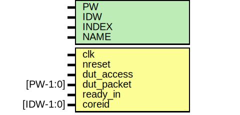

# Entity: emesh_monitor

- **File**: emesh_monitor.v
## Diagram

## Description

 verilator lint_off STMTDLY */

## Generics

| Generic name | Type | Value          | Description |
| ------------ | ---- | -------------- | ----------- |
| PW           |      | 104            |             |
| IDW          |      | 12             |             |
| INDEX        |      | 0              |             |
| NAME         |      | "not_declared" |             |
## Ports

| Port name  | Direction | Type      | Description                      |
| ---------- | --------- | --------- | -------------------------------- |
| clk        | input     |           | clock and reset                  |
| nreset     | input     |           |                                  |
| dut_access | input     |           | monitors transaction on the wire |
| dut_packet | input     | [PW-1:0]  |                                  |
| ready_in   | input     |           |                                  |
| coreid     | input     | [IDW-1:0] |                                  |
## Signals

| Name      | Type        | Description          |
| --------- | ----------- | -------------------- |
| ftrace    | reg [31:0]  | core name for trace  |
| tracefile | reg [255:0] |                      |
## Processes
- unnamed: ( @ (posedge clk or negedge nreset) )
  - **Type:** always
