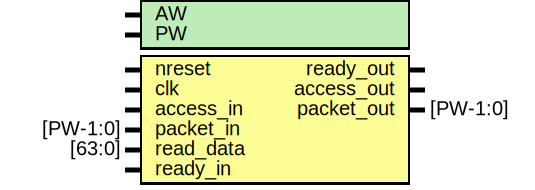

# Entity: emesh_readback

- **File**: emesh_readback.v
## Diagram

## Generics

| Generic name | Type | Value | Description       |
| ------------ | ---- | ----- | ----------------- |
| AW           |      | 32    |  address width    |
| PW           |      | 104   |  packet width     |
## Ports

| Port name  | Direction | Type     | Description                   |
| ---------- | --------- | -------- | ----------------------------- |
| nreset     | input     |          | asynchronous active low reset |
| clk        | input     |          | clock                         |
| access_in  | input     |          | register access               |
| packet_in  | input     | [PW-1:0] | data/address                  |
| ready_out  | output    |          | pushback from mesh            |
| read_data  | input     | [63:0]   | data from register/memorye    |
| access_out | output    |          | register access               |
| packet_out | output    | [PW-1:0] | data/address                  |
| ready_in   | input     |          | pushback from mesh            |
## Signals

| Name         | Type          | Description                 |
| ------------ | ------------- | --------------------------- |
| ctrlmode_in  | wire [12:0]   | From p2e of packet2emesh.v  |
| data_in      | wire [AW-1:0] | From p2e of packet2emesh.v  |
| datamode_in  | wire [1:0]    | From p2e of packet2emesh.v  |
| dstaddr_in   | wire [AW-1:0] | From p2e of packet2emesh.v  |
| srcaddr_in   | wire [AW-1:0] | From p2e of packet2emesh.v  |
| write_in     | wire          | From p2e of packet2emesh.v  |
| datamode_out | reg [1:0]     |  End of automatics          |
| ctrlmode_out | reg [4:0]     |                             |
| dstaddr_out  | reg [AW-1:0]  |                             |
| data_out     | wire [AW-1:0] |                             |
| srcaddr_out  | wire [AW-1:0] |                             |
| access_out   | reg           |                             |
## Processes
- unnamed: ( @ (posedge clk or negedge nreset) )
  - **Type:** always
 **Description**
######################################## # Pipeline #######################################    access 
- unnamed: ( @ (posedge clk) )
  - **Type:** always
 **Description**
packet 
