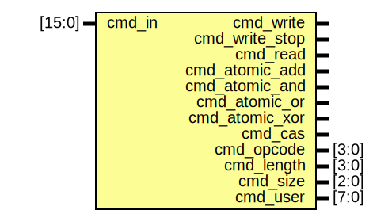

# Entity: enoc_decode

- **File**: enoc_decode.v
## Diagram

## Description

******************************************************************************

## Ports

| Port name      | Direction | Type   | Description    |
| -------------- | --------- | ------ | -------------- |
| cmd_in         | input     | [15:0] | Packet Command |
| cmd_write      | output    |        | Write          |
| cmd_write_stop | output    |        |                |
| cmd_read       | output    |        | Read           |
| cmd_atomic_add | output    |        |                |
| cmd_atomic_and | output    |        |                |
| cmd_atomic_or  | output    |        |                |
| cmd_atomic_xor | output    |        |                |
| cmd_cas        | output    |        |                |
| cmd_opcode     | output    | [3:0]  | Fields         |
| cmd_length     | output    | [3:0]  |                |
| cmd_size       | output    | [2:0]  |                |
| cmd_user       | output    | [7:0]  |                |
