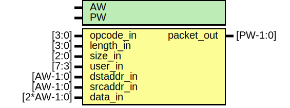

# Entity: enoc_pack

- **File**: enoc_pack.v
## Diagram

## Description

******************************************************************************

## Generics

| Generic name | Type | Value | Description |
| ------------ | ---- | ----- | ----------- |
| AW           |      | 64    |             |
| PW           |      | 144   |             |
## Ports

| Port name  | Direction | Type       | Description                |
| ---------- | --------- | ---------- | -------------------------- |
| opcode_in  | input     | [3:0]      | Command Inputs             |
| length_in  | input     | [3:0]      | burst length(1-16)         |
| size_in    | input     | [2:0]      | size of each transfer      |
| user_in    | input     | [7:3]      | user control field         |
| dstaddr_in | input     | [AW-1:0]   | destination address        |
| srcaddr_in | input     | [AW-1:0]   | source address (for reads) |
| data_in    | input     | [2*AW-1:0] | data                       |
| packet_out | output    | [PW-1:0]   | Output packet              |
## Signals

| Name    | Type        | Description                                                                                               |
| ------- | ----------- | --------------------------------------------------------------------------------------------------------- |
| cmd_out | wire [15:0] | ############################################  Command Field ############################################  |
## Instantiations

- enoc_decode: enoc_decode
 **Description**
Inputs

