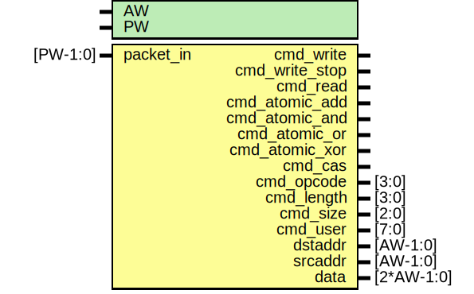

# Entity: enoc_unpack

- **File**: enoc_unpack.v
## Diagram

## Description

******************************************************************************

## Generics

| Generic name | Type | Value | Description      |
| ------------ | ---- | ----- | ---------------- |
| AW           |      | 32    |  address width   |
| PW           |      | 104   |  packet width    |
## Ports

| Port name      | Direction | Type       | Description               |
| -------------- | --------- | ---------- | ------------------------- |
| packet_in      | input     | [PW-1:0]   | Input packet              |
| cmd_write      | output    |            | start write               |
| cmd_write_stop | output    |            | stop burst                |
| cmd_read       | output    |            | Read                      |
| cmd_atomic_add | output    |            | Atomic read/write         |
| cmd_atomic_and | output    |            |                           |
| cmd_atomic_or  | output    |            |                           |
| cmd_atomic_xor | output    |            |                           |
| cmd_cas        | output    |            |                           |
| cmd_opcode     | output    | [3:0]      | raw opcode                |
| cmd_length     | output    | [3:0]      | bust length(up to 16)     |
| cmd_size       | output    | [2:0]      | size of each transfer     |
| cmd_user       | output    | [7:0]      | user field                |
| dstaddr        | output    | [AW-1:0]   | read/write target address |
| srcaddr        | output    | [AW-1:0]   | read return address       |
| data           | output    | [2*AW-1:0] | write data                |
## Signals

| Name | Type        | Description |
| ---- | ----------- | ----------- |
| cmd  | wire [15:0] |             |
## Instantiations

- enoc_decode: enoc_decode
 **Description**
Input

