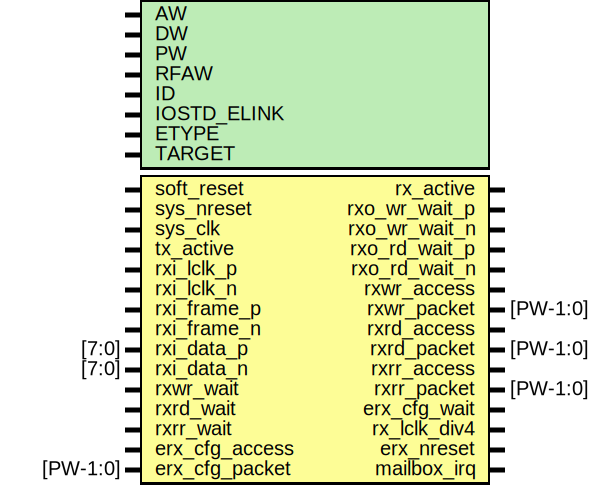

# Entity: erx

- **File**: erx.v
## Diagram

## Generics

| Generic name | Type | Value     | Description |
| ------------ | ---- | --------- | ----------- |
| AW           |      | 32        |             |
| DW           |      | 32        |             |
| PW           |      | 104       |             |
| RFAW         |      | 6         |             |
| ID           |      | 12'h800   |             |
| IOSTD_ELINK  |      | "LVDS_25" |             |
| ETYPE        |      | 1         |             |
| TARGET       |      | "GENERIC" |             |
## Ports

| Port name      | Direction | Type     | Description                           |
| -------------- | --------- | -------- | ------------------------------------- |
| soft_reset     | input     |          | sw driven reset                       |
| sys_nreset     | input     |          | async reset                           |
| sys_clk        | input     |          | system clock for fifo/clocks          |
| tx_active      | input     |          | holds rx in check until tx has booted |
| rx_active      | output    |          | indicates RX and TX are active        |
| rxi_lclk_p     | input     |          | rx clock input                        |
|    rxi_lclk_n  | input     |          | rx clock input                        |
| rxi_frame_p    | input     |          | rx frame signal                       |
|   rxi_frame_n  | input     |          | rx frame signal                       |
| rxi_data_p     | input     | [7:0]    | rx data                               |
|    rxi_data_n  | input     | [7:0]    | rx data                               |
| rxo_wr_wait_p  | output    |          | rx write pushback output              |
| rxo_wr_wait_n  | output    |          | rx write pushback output              |
| rxo_rd_wait_p  | output    |          | rx read pushback output               |
| rxo_rd_wait_n  | output    |          | rx read pushback output               |
| rxwr_access    | output    |          | Master write                          |
| rxwr_packet    | output    | [PW-1:0] |                                       |
| rxwr_wait      | input     |          |                                       |
| rxrd_access    | output    |          | Master read request                   |
| rxrd_packet    | output    | [PW-1:0] |                                       |
| rxrd_wait      | input     |          |                                       |
| rxrr_access    | output    |          | Slave read response                   |
| rxrr_packet    | output    | [PW-1:0] |                                       |
| rxrr_wait      | input     |          |                                       |
| erx_cfg_access | input     |          | Configuration Interface (from ETX)    |
| erx_cfg_packet | input     | [PW-1:0] |                                       |
| erx_cfg_wait   | output    |          |                                       |
| rx_lclk_div4   | output    |          |                                       |
| erx_nreset     | output    |          |                                       |
| mailbox_irq    | output    |          | Mailbox interrupt                     |
## Signals

| Name             | Type          | Description                      |
| ---------------- | ------------- | -------------------------------- |
| erx_io_nreset    | wire          | From erx_clocks of erx_clocks.v  |
| idelay_value     | wire [44:0]   | From erx_core of erx_core.v      |
| load_taps        | wire          | From erx_core of erx_core.v      |
| rx_access        | wire          | From erx_io of erx_io.v          |
| rx_burst         | wire          | From erx_io of erx_io.v          |
| rx_clkin         | wire          | From erx_io of erx_io.v          |
| rx_lclk          | wire          | From erx_clocks of erx_clocks.v  |
| rx_packet        | wire [PW-1:0] | From erx_io of erx_io.v          |
| rx_rd_wait       | wire          | From erx_core of erx_core.v      |
| rx_wr_wait       | wire          | From erx_core of erx_core.v      |
| rxrd_fifo_access | wire          | From erx_core of erx_core.v      |
| rxrd_fifo_packet | wire [PW-1:0] | From erx_core of erx_core.v      |
| rxrd_fifo_wait   | wire          | From erx_fifo of erx_fifo.v      |
| rxrr_fifo_access | wire          | From erx_core of erx_core.v      |
| rxrr_fifo_packet | wire [PW-1:0] | From erx_core of erx_core.v      |
| rxrr_fifo_wait   | wire          | From erx_fifo of erx_fifo.v      |
| rxwr_fifo_access | wire          | From erx_core of erx_core.v      |
| rxwr_fifo_packet | wire [PW-1:0] | From erx_core of erx_core.v      |
| rxwr_fifo_wait   | wire          | From erx_fifo of erx_fifo.v      |
## Instantiations

- erx_clocks: erx_clocks
 **Description**
AUTOINST*/

