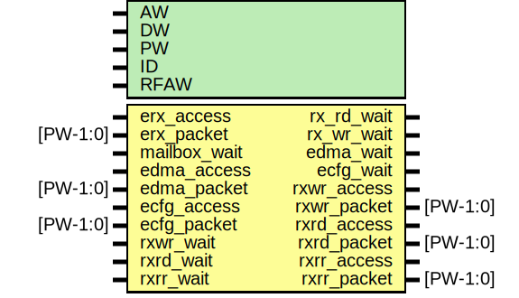

# Entity: erx_arbiter

- **File**: erx_arbiter.v
## Diagram

## Generics

| Generic name | Type | Value   | Description |
| ------------ | ---- | ------- | ----------- |
| AW           |      | 32      |             |
| DW           |      | 32      |             |
| PW           |      | 104     |             |
| ID           |      | 12'h800 | link id     |
| RFAW         |      | 6       |             |
## Ports

| Port name    | Direction | Type     | Description                 |
| ------------ | --------- | -------- | --------------------------- |
| erx_access   | input     |          | from MMU                    |
| erx_packet   | input     | [PW-1:0] |                             |
| rx_rd_wait   | output    |          | for IO                      |
| rx_wr_wait   | output    |          | for IO                      |
| mailbox_wait | input     |          | Pushback from mailbox       |
| edma_access  | input     |          | From DMA                    |
| edma_packet  | input     | [PW-1:0] |                             |
| edma_wait    | output    |          |                             |
| ecfg_access  | input     |          | From ETX                    |
| ecfg_packet  | input     | [PW-1:0] |                             |
| ecfg_wait    | output    |          |                             |
| rxwr_access  | output    |          | To Master Write FIFO        |
| rxwr_packet  | output    | [PW-1:0] |                             |
| rxwr_wait    | input     |          |                             |
| rxrd_access  | output    |          | To Master Read FIFO         |
| rxrd_packet  | output    | [PW-1:0] |                             |
| rxrd_wait    | input     |          |                             |
| rxrr_access  | output    |          | To Slave Read Response FIFO |
| rxrr_packet  | output    | [PW-1:0] |                             |
| rxrr_wait    | input     |          |                             |
## Signals

| Name        | Type          | Description                                                                                |
| ----------- | ------------- | ------------------------------------------------------------------------------------------ |
| erx_write   | wire          | #################################### Splicing pakets ####################################  |
| erx_dstaddr | wire [AW-1:0] |                                                                                            |
| erx_read    | wire          |                                                                                            |
