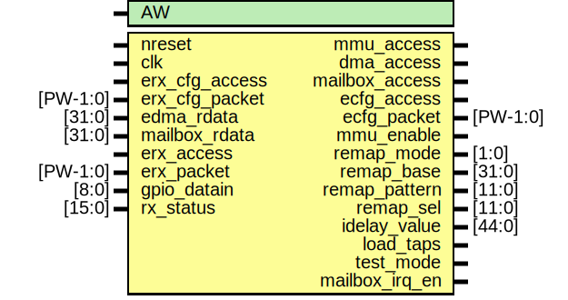

# Entity: erx_cfg

- **File**: erx_cfg.v
## Diagram

## Generics

| Generic name | Type | Value | Description     |
| ------------ | ---- | ----- | --------------- |
| AW           |      | 32    |  address width  |
## Ports

| Port name      | Direction | Type     | Description                             |
| -------------- | --------- | -------- | --------------------------------------- |
| nreset         | input     |          | async active low reset                  |
| clk            | input     |          | slow clock                              |
| erx_cfg_access | input     |          | access from TX                          |
| erx_cfg_packet | input     | [PW-1:0] | packet                                  |
| mmu_access     | output    |          | mmu access                              |
| dma_access     | output    |          | dma access                              |
| mailbox_access | output    |          | mailbox access                          |
| edma_rdata     | input     | [31:0]   | dma readback data                       |
| mailbox_rdata  | input     | [31:0]   | mailbox readback data                   |
| ecfg_access    | output    |          | access signal for axi_slave             |
| ecfg_packet    | output    | [PW-1:0] | readback data for axi_slave             |
| mmu_enable     | output    |          | enables MMU on rx path (static)         |
| remap_mode     | output    | [1:0]    | remap mode (static)                     |
| remap_base     | output    | [31:0]   | base for dynamic remap (static)         |
| remap_pattern  | output    | [11:0]   | patter for static remap (static)        |
| remap_sel      | output    | [11:0]   | selects for static remap (static)       |
| idelay_value   | output    | [44:0]   | tap values for erx idelay               |
| load_taps      | output    |          | loads the idelay_value into IDELAY prim |
| test_mode      | output    |          | testmode blocks all rx ports to fifo    |
| mailbox_irq_en | output    |          | irq enable for mailbox                  |
| erx_access     | input     |          | rx raw access for debug                 |
| erx_packet     | input     | [PW-1:0] | rx raw packet for debug                 |
| gpio_datain    | input     | [8:0]    | frame and data inputs (static)          |
| rx_status      | input     | [15:0]   | etx status signals                      |
## Signals

| Name            | Type          | Description                                                                                                                                             |
| --------------- | ------------- | ------------------------------------------------------------------------------------------------------------------------------------------------------- |
| rx_cfg_reg      | reg [31:0]    | ################################################################## # BODY ################################################################## registers  |
| rx_offset_reg   | reg [31:0]    |                                                                                                                                                         |
| rx_gpio_reg     | reg [8:0]     |                                                                                                                                                         |
| rx_status_reg   | reg [15:0]    |                                                                                                                                                         |
| rx_testdata_reg | reg [31:0]    |                                                                                                                                                         |
| idelay          | reg [44:0]    |                                                                                                                                                         |
| load_taps       | reg           |                                                                                                                                                         |
| cfg_rdata       | reg [31:0]    |                                                                                                                                                         |
| data_out        | reg [AW-1:0]  |                                                                                                                                                         |
| dstaddr_out     | reg [AW-1:0]  |                                                                                                                                                         |
| srcaddr_out     | reg [AW-1:0]  |                                                                                                                                                         |
| write_out       | reg           |                                                                                                                                                         |
| ctrlmode_out    | reg [4:0]     |                                                                                                                                                         |
| datamode_out    | reg [1:0]     |                                                                                                                                                         |
| ecfg_access     | reg           |                                                                                                                                                         |
| rx_sel          | reg           |                                                                                                                                                         |
| dma_sel         | reg           |                                                                                                                                                         |
| mailbox_sel     | reg           |                                                                                                                                                         |
| tx_sel          | reg           |                                                                                                                                                         |
| data_mux        | wire [31:0]   |                                                                                                                                                         |
| ctrlmode_in     | wire [4:0]    | From p2e of packet2emesh.v                                                                                                                              |
| data_in         | wire [AW-1:0] | From p2e of packet2emesh.v                                                                                                                              |
| datamode_in     | wire [1:0]    | From p2e of packet2emesh.v                                                                                                                              |
| dstaddr_in      | wire [AW-1:0] | From p2e of packet2emesh.v                                                                                                                              |
| srcaddr_in      | wire [AW-1:0] | From p2e of packet2emesh.v                                                                                                                              |
| write_in        | wire          | From p2e of packet2emesh.v                                                                                                                              |
## Constants

| Name | Type | Value   | Description          |
| ---- | ---- | ------- | -------------------- |
| PW   |      | 2*AW+40 | packet width         |
| RFAW |      | 6       | register block size  |
## Processes
- unnamed: ( @ (posedge clk or negedge nreset) )
  - **Type:** always
 **Description**
########################### # RXCFG ########################### 
- unnamed: ( @ (posedge clk) )
  - **Type:** always
 **Description**
###########################1 # STATUS ###########################    
- unnamed: ( @ (posedge clk) )
  - **Type:** always
 **Description**
########################### # GPIO-DATAIN ########################### 
- unnamed: ( @ (posedge clk) )
  - **Type:** always
 **Description**
###########################1 # DYNAMIC REMAP BASE ########################### 
- unnamed: ( @ (posedge clk) )
  - **Type:** always
 **Description**
###########################1 # IDELAY TAP VALUES ########################### 
- unnamed: ( @ (posedge clk) )
  - **Type:** always
- unnamed: ( @ (posedge clk) )
  - **Type:** always
 **Description**
############################### # TESTMODE (ADD OR/LFSR..) ###############################   
- unnamed: ( @ (posedge clk) )
  - **Type:** always
 **Description**
############################### # DATA READBACK MUX ############################### 
- unnamed: ( @ (posedge clk) )
  - **Type:** always
 **Description**
############################### # FORWARD PACKET TO OUTPUT ############################### pipeline 
## Instantiations

- mux4: oh_mux4
 **Description**
readback mux (should be one hot!)

