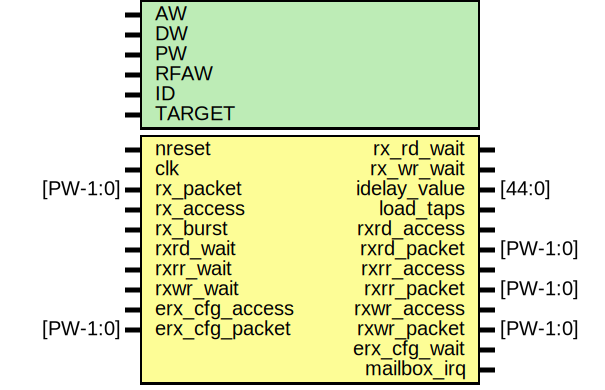

# Entity: erx_core

- **File**: erx_core.v
## Diagram

## Generics

| Generic name | Type | Value     | Description |
| ------------ | ---- | --------- | ----------- |
| AW           |      | 32        |             |
| DW           |      | 32        |             |
| PW           |      | 104       |             |
| RFAW         |      | 6         |             |
| ID           |      | 12'h999   |             |
| TARGET       |      | "GENERIC" |             |
## Ports

| Port name      | Direction | Type     | Description        |
| -------------- | --------- | -------- | ------------------ |
| nreset         | input     |          | synced to clk      |
| clk            | input     |          |                    |
| rx_packet      | input     | [PW-1:0] | IO Interface       |
| rx_access      | input     |          |                    |
| rx_burst       | input     |          |                    |
| rx_rd_wait     | output    |          |                    |
| rx_wr_wait     | output    |          |                    |
| idelay_value   | output    | [44:0]   |                    |
| load_taps      | output    |          |                    |
| rxrd_access    | output    |          | FIFO Access        |
| rxrd_packet    | output    | [PW-1:0] |                    |
| rxrd_wait      | input     |          |                    |
| rxrr_access    | output    |          |                    |
| rxrr_packet    | output    | [PW-1:0] |                    |
| rxrr_wait      | input     |          |                    |
| rxwr_access    | output    |          |                    |
| rxwr_packet    | output    | [PW-1:0] |                    |
| rxwr_wait      | input     |          |                    |
| erx_cfg_access | input     |          | register interface |
| erx_cfg_packet | input     | [PW-1:0] |                    |
| erx_cfg_wait   | output    |          |                    |
| mailbox_irq    | output    |          | mailbox outputs    |
## Signals

| Name               | Type          | Description                          |
| ------------------ | ------------- | ------------------------------------ |
| dma_access         | wire          | From erx_cfg of erx_cfg.v            |
| ecfg_access        | wire          | From erx_cfg of erx_cfg.v            |
| ecfg_packet        | wire [PW-1:0] | From erx_cfg of erx_cfg.v            |
| edma_wait          | wire          | From erx_arbiter of erx_arbiter.v    |
| emesh_remap_access | wire          | From erx_remap of erx_remap.v        |
| emesh_remap_packet | wire [PW-1:0] | From erx_remap of erx_remap.v        |
| emmu_access        | wire          | From erx_mmu of emmu.v               |
| emmu_packet        | wire [PW-1:0] | From erx_mmu of emmu.v               |
| erx_access         | wire          | From erx_protocol of erx_protocol.v  |
| erx_packet         | wire [PW-1:0] | From erx_protocol of erx_protocol.v  |
| mailbox_access     | wire          | From erx_cfg of erx_cfg.v            |
| mailbox_irq_en     | wire          | From erx_cfg of erx_cfg.v            |
| mailbox_rdata      | wire [31:0]   | From erx_mailbox of emailbox.v       |
| mailbox_wait       | wire          | From erx_mailbox of emailbox.v       |
| mmu_access         | wire          | From erx_cfg of erx_cfg.v            |
| mmu_enable         | wire          | From erx_cfg of erx_cfg.v            |
| remap_base         | wire [31:0]   | From erx_cfg of erx_cfg.v            |
| remap_mode         | wire [1:0]    | From erx_cfg of erx_cfg.v            |
| remap_pattern      | wire [11:0]   | From erx_cfg of erx_cfg.v            |
| remap_sel          | wire [11:0]   | From erx_cfg of erx_cfg.v            |
| test_mode          | wire          | From erx_cfg of erx_cfg.v            |
| gpio_datain        | wire [8:0]    |  End of automatics regs              |
| rx_status          | wire [15:0]   |                                      |
| rxwr_full          | wire          |                                      |
| rxrr_full          | wire          |                                      |
| rxrd_full          | wire          |                                      |
| rxrd_empty         | wire          |                                      |
| rxwr_empty         | wire          |                                      |
| rxrr_empty         | wire          |                                      |
| edma_packet        | wire [103:0]  |                                      |
