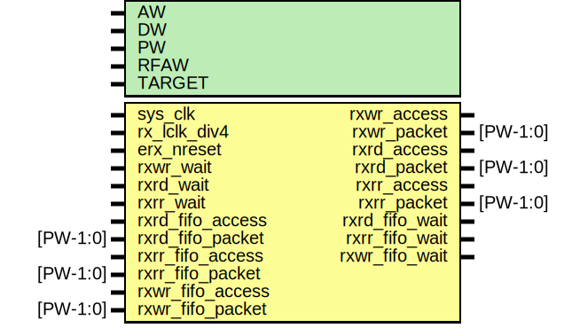

# Entity: erx_fifo

- **File**: erx_fifo.v
## Diagram

## Generics

| Generic name | Type | Value     | Description |
| ------------ | ---- | --------- | ----------- |
| AW           |      | 32        |             |
| DW           |      | 32        |             |
| PW           |      | 104       |             |
| RFAW         |      | 6         |             |
| TARGET       |      | "GENERIC" |             |
## Ports

| Port name        | Direction | Type     | Description                  |
| ---------------- | --------- | -------- | ---------------------------- |
| sys_clk          | input     |          | reset & clocks               |
| rx_lclk_div4     | input     |          |                              |
| erx_nreset       | input     |          | keep in reset longer         |
| rxwr_access      | output    |          | WR to AXI master             |
| rxwr_packet      | output    | [PW-1:0] |                              |
| rxwr_wait        | input     |          |                              |
| rxrd_access      | output    |          | RD to AXI master             |
| rxrd_packet      | output    | [PW-1:0] |                              |
| rxrd_wait        | input     |          |                              |
| rxrr_access      | output    |          | RR to AXI slave              |
| rxrr_packet      | output    | [PW-1:0] |                              |
| rxrr_wait        | input     |          |                              |
| rxrd_fifo_access | input     |          | To rxrd_fifo of fifo_cdc.v   |
| rxrd_fifo_packet | input     | [PW-1:0] | To rxrd_fifo of fifo_cdc.v   |
| rxrd_fifo_wait   | output    |          | From rxrd_fifo of fifo_cdc.v |
| rxrr_fifo_access | input     |          | To rxrr_fifo of fifo_cdc.v   |
| rxrr_fifo_packet | input     | [PW-1:0] | To rxrr_fifo of fifo_cdc.v   |
| rxrr_fifo_wait   | output    |          | From rxrr_fifo of fifo_cdc.v |
| rxwr_fifo_access | input     |          | To rxwr_fifo of fifo_cdc.v   |
| rxwr_fifo_packet | input     | [PW-1:0] | To rxwr_fifo of fifo_cdc.v   |
| rxwr_fifo_wait   | output    |          | From rxwr_fifo of fifo_cdc.v |
