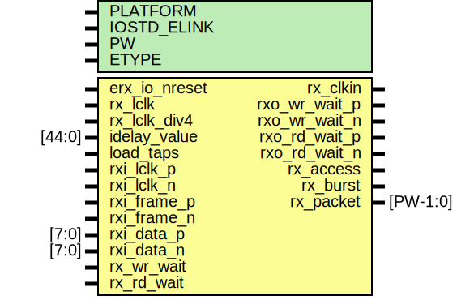

# Entity: erx_io

- **File**: erx_io.v
## Diagram

## Description

## Generics

| Generic name | Type | Value         | Description   |
| ------------ | ---- | ------------- | ------------- |
| PLATFORM     |      | `CFG_PLATFORM |               |
| IOSTD_ELINK  |      | "LVDS_25"     |               |
| PW           |      | 104           |               |
| ETYPE        |      | 1             | 0=parallella  |
## Ports

| Port name     | Direction | Type     | Description                                                                 |
| ------------- | --------- | -------- | --------------------------------------------------------------------------- |
| erx_io_nreset | input     |          | high sped reset                                                             |
| rx_lclk       | input     |          | fast I/O clock                                                              |
| rx_lclk_div4  | input     |          | slow clock                                                                  |
| rx_clkin      | output    |          | clock output for pll                                                        |
| idelay_value  | input     | [44:0]   | ########################## idelays #########################                |
| load_taps     | input     |          |                                                                             |
| rxi_lclk_p    | input     |          | rx clock input                                                              |
|    rxi_lclk_n | input     |          | rx clock input                                                              |
| rxi_frame_p   | input     |          | rx frame signal                                                             |
|   rxi_frame_n | input     |          | rx frame signal                                                             |
| rxi_data_p    | input     | [7:0]    | rx data                                                                     |
|    rxi_data_n | input     | [7:0]    | rx data                                                                     |
| rxo_wr_wait_p | output    |          | rx write pushback output                                                    |
| rxo_wr_wait_n | output    |          | rx write pushback output                                                    |
| rxo_rd_wait_p | output    |          | rx read pushback output                                                     |
| rxo_rd_wait_n | output    |          | rx read pushback output                                                     |
| rx_access     | output    |          | ########################### erx logic interface ##########################  |
| rx_burst      | output    |          |                                                                             |
| rx_packet     | output    | [PW-1:0] |                                                                             |
| rx_wr_wait    | input     |          |                                                                             |
| rx_rd_wait    | input     |          |                                                                             |
## Signals

| Name           | Type         | Description                                                                                                             |
| -------------- | ------------ | ----------------------------------------------------------------------------------------------------------------------- |
| rxi_data       | wire [7:0]   | ############ # WIRES ############                                                                                       |
| rxi_frame      | wire         |                                                                                                                         |
| rxi_lclk       | wire         |                                                                                                                         |
| access_wide    | wire         |                                                                                                                         |
| rx_word_iddr   | wire [15:0]  |                                                                                                                         |
| rx_frame_iddr  | wire         |                                                                                                                         |
| valid_packet   | reg          | ############ # REGS ############                                                                                        |
| rx_word_sync   | reg [15:0]   |                                                                                                                         |
| rx_sample      | reg [111:0]  |                                                                                                                         |
| rx_pointer     | reg [6:0]    |                                                                                                                         |
| access         | reg          |                                                                                                                         |
| burst          | reg          |                                                                                                                         |
| rx_packet_lclk | reg [PW-1:0] |                                                                                                                         |
| rx_access      | reg          |                                                                                                                         |
| rx_packet      | reg [PW-1:0] |                                                                                                                         |
| rx_burst       | reg          |                                                                                                                         |
| rxi_delay_in   | wire [8:0]   |                                                                                                                         |
| rxi_delay_out  | wire [8:0]   |                                                                                                                         |
| burst_detect   | reg          |                                                                                                                         |
| valid          | reg [3:0]    |                                                                                                                         |
| rx_frame       | reg          | ####################################### #Register DDR inputs for better timing #######################################  |
| rx_word        | reg [15:0]   |                                                                                                                         |
| rx_lclk_iddr   | wire         | ################################### #RX CLOCK for IDDR ###################################                              |
## Processes
- unnamed: ( @ (posedge rx_lclk) )
  - **Type:** always
- unnamed: ( @ (posedge rx_lclk or negedge erx_io_nreset) )
  - **Type:** always
 **Description**
##################### #CREATE 112 BIT PACKET  ##################### write Pointer    
- unnamed: ( @ (posedge rx_lclk) )
  - **Type:** always
 **Description**
middle of frame convert to 112 bit packet 
- unnamed: ( @ (posedge rx_lclk) )
  - **Type:** always
 **Description**
 if (rx_frame) #####################   #DATA VALID SIGNAL  #################### 
- unnamed: ( @ (posedge rx_lclk or negedge erx_io_nreset) )
  - **Type:** always
- unnamed: ( @ (posedge rx_lclk or negedge erx_io_nreset) )
  - **Type:** always
 **Description**
################################### #SAMPLE AND HOLD DATA ################################### (..and shuffle data for 104 bit packet) seems redundant??? for burst?? 
- unnamed: ( @ (posedge rx_lclk) )
  - **Type:** always
- unnamed: ( @ (posedge rx_lclk) )
  - **Type:** always
 **Description**
################################### #SYNCHRONIZE TO SLOW CLK ###################################  stretch access pulse to 4 cycles use shift register for speed TODO: simplify 
- unnamed: ( @ (posedge rx_lclk_div4) )
  - **Type:** always
 **Description**
access 
- unnamed: ( @ (posedge rx_lclk_div4) )
  - **Type:** always
 **Description**
packet 
- unnamed: ( @ (posedge rx_lclk_div4) )
  - **Type:** always
 **Description**
burst 
## Instantiations

- ibuf_data[7:0]: IBUFDS
 **Description**
################################
# I/O Buffers Instantiation
################################

- ibuf_frame: IBUFDS
- ibuf_lclk: IBUFDS
- ibuf_lclk: IBUFDS
- i_bufio0: BUFIO
 **Description**
for iddr

