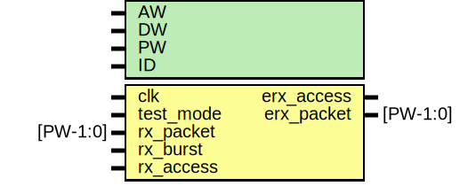

# Entity: erx_protocol

- **File**: erx_protocol.v
## Diagram

## Description

############################################################
#This block handles the autoincrement needed for bursting
############################################################

## Generics

| Generic name | Type | Value   | Description |
| ------------ | ---- | ------- | ----------- |
| AW           |      | 32      |             |
| DW           |      | 32      |             |
| PW           |      | 104     |             |
| ID           |      | 12'h999 | link id     |
## Ports

| Port name  | Direction | Type     | Description                                  |
| ---------- | --------- | -------- | -------------------------------------------- |
| clk        | input     |          |  System reset input                          |
| test_mode  | input     |          | block all traffic in test mode               |
| rx_packet  | input     | [PW-1:0] |  Parallel interface, 8 eLink bytes at a time |
| rx_burst   | input     |          |                                              |
| rx_access  | input     |          |                                              |
| erx_access | output    |          |  Output to MMU / filter                      |
| erx_packet | output    | [PW-1:0] |                                              |
## Signals

| Name         | Type         | Description |
| ------------ | ------------ | ----------- |
| dstaddr_reg  | reg [31:0]   | wires       |
| dstaddr_next | wire [31:0]  |             |
| dstaddr_mux  | wire [31:0]  |             |
| erx_access   | reg          |             |
| erx_packet   | reg [PW-1:0] |             |
| rx_addr      | wire [31:0]  |             |
## Processes
- unnamed: ( @ (posedge clk) )
  - **Type:** always
 **Description**
Address generator for bursting 
- unnamed: ( @ (posedge clk) )
  - **Type:** always
 **Description**
Pipeline stage and decode   
