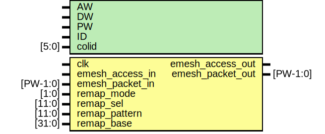

# Entity: erx_remap

- **File**: erx_remap.v
## Diagram

## Generics

| Generic name | Type  | Value   | Description  |
| ------------ | ----- | ------- | ------------ |
| AW           |       | 32      |              |
| DW           |       | 32      |              |
| PW           |       | 104     |              |
| ID           |       | 12'h808 |              |
| colid        | [5:0] | ID[5:0] | TODO:FIX!??  |
## Ports

| Port name        | Direction | Type     | Description                     |
| ---------------- | --------- | -------- | ------------------------------- |
| clk              | input     |          | Clock/reset                     |
| emesh_access_in  | input     |          | Input from arbiter              |
| emesh_packet_in  | input     | [PW-1:0] |                                 |
| remap_mode       | input     | [1:0]    | 00=none,01=static,02=continuity |
| remap_sel        | input     | [11:0]   | number of bits to remap         |
| remap_pattern    | input     | [11:0]   | static pattern to map to        |
| remap_base       | input     | [31:0]   | remap offset                    |
| emesh_access_out | output    |          | Output to TX IO                 |
| emesh_packet_out | output    | [PW-1:0] |                                 |
## Signals

| Name             | Type         | Description |
| ---------------- | ------------ | ----------- |
| static_remap     | wire [31:0]  |             |
| dynamic_remap    | wire [31:0]  |             |
| remap_mux        | wire [31:0]  |             |
| addr_in          | wire [31:0]  |             |
| addr_out         | wire [31:0]  |             |
| remap_en         | wire         |             |
| emesh_access_out | reg          |             |
| emesh_packet_out | reg [PW-1:0] |             |
## Processes
- unnamed: ( @ (posedge clk) )
  - **Type:** always
 **Description**
Access pipeline 
- unnamed: ( @ (posedge clk) )
  - **Type:** always
 **Description**
Packet Remapping 
