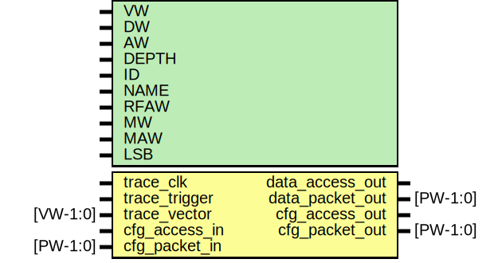

# Entity: etrace

- **File**: etrace.v
## Diagram

## Generics

| Generic name | Type | Value         | Description                        |
| ------------ | ---- | ------------- | ---------------------------------- |
| VW           |      | 32            | width of vector to sample          |
| DW           |      | 32            | width of counter                   |
| AW           |      | 32            | width of address input bus         |
| DEPTH        |      | 1024          | memory depth                       |
| ID           |      | 999           |                                    |
| NAME         |      | "my"          |                                    |
| RFAW         |      | 6             |                                    |
| MW           |      | VW+DW         | memory width should be 64,128,256  |
| MAW          |      | $clog2(DEPTH) |                                    |
| LSB          |      | $clog2(MW/32) | address lsb for memory             |
## Ports

| Port name       | Direction | Type     | Description              |
| --------------- | --------- | -------- | ------------------------ |
| trace_clk       | input     |          | Logic analyzer interface |
| trace_trigger   | input     |          |                          |
| trace_vector    | input     | [VW-1:0] |                          |
| data_access_out | output    |          | Data streaming interface |
| data_packet_out | output    | [PW-1:0] |                          |
| cfg_access_in   | input     |          | Config interface         |
| cfg_packet_in   | input     | [PW-1:0] |                          |
| cfg_access_out  | output    |          |                          |
| cfg_packet_out  | output    | [PW-1:0] |                          |
## Signals

| Name              | Type          | Description                 |
| ----------------- | ------------- | --------------------------- |
| cfg_reg           | reg [15:0]    | local regs                  |
| cycle_counter     | reg [DW-1:0]  |                             |
| trace_vector_reg  | reg [VW-1:0]  |                             |
| mi_addr_reg       | reg [2:0]     |                             |
| trace_addr        | reg [MAW-1:0] |                             |
| mi_write          | wire          |                             |
| mi_cfg_write      | wire          |                             |
| mem_data          | wire [MW-1:0] |                             |
| trace_enable_sync | wire          |                             |
| ctrlmode_out      | wire [3:0]    |                             |
| data_out          | wire [DW-1:0] |                             |
| datamode_out      | wire [1:0]    |                             |
| dstaddr_out       | wire [AW-1:0] |                             |
| srcaddr_out       | wire [AW-1:0] |                             |
| write_out         | wire          |                             |
| packet_out        | wire [PW-1:0] | From e2p of emesh2packet.v  |
| ftrace            | reg [31:0]    |                             |
| tracefile         | reg [255:0]   |                             |
## Processes
- unnamed: ( @ (posedge mi_clk) )
  - **Type:** always
 **Description**
TODO: parametrize 
- unnamed: ( @ (posedge mi_clk) )
  - **Type:** always
 **Description**
########################### # CONFIG ########################### Destination start address ETRACE_BASEADDR [32 bit] Destination samples       ETRACE_SAMPLES [32 bit] 
- unnamed: ( @ (posedge trace_clk) )
  - **Type:** always
 **Description**
########################### # TIME KEEPER ########################### count if trigger enabled and counter enabled (SW + HW) 
- unnamed: ( @ (posedge trace_clk) )
  - **Type:** always
 **Description**
########################### # SAMPLING LOGIC ###########################    Change detect logic 
- unnamed: ( @ (posedge trace_clk) )
  - **Type:** always
 **Description**
Address counter 
- unnamed: ( @ (posedge trace_clk) )
  - **Type:** always
## Instantiations

- dsync: dsync
 **Description**
Outputs

