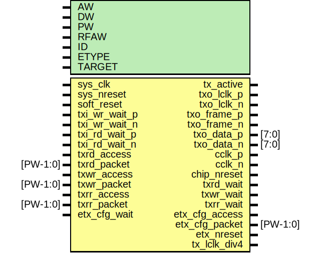

# Entity: etx

- **File**: etx.v
## Diagram

## Generics

| Generic name | Type | Value     | Description |
| ------------ | ---- | --------- | ----------- |
| AW           |      | 32        |             |
| DW           |      | 32        |             |
| PW           |      | 104       |             |
| RFAW         |      | 6         |             |
| ID           |      | 12'h000   |             |
| ETYPE        |      | 0         |             |
| TARGET       |      | "GENERIC" |             |
## Ports

| Port name      | Direction | Type     | Description                       |
| -------------- | --------- | -------- | --------------------------------- |
| sys_clk        | input     |          | clock for fifos                   |
| sys_nreset     | input     |          | reset for fifos                   |
| soft_reset     | input     |          | software controlled reset         |
| tx_active      | output    |          | tx ready to transmit              |
| txo_lclk_p     | output    |          | tx clock output                   |
| txo_lclk_n     | output    |          | tx clock output                   |
| txo_frame_p    | output    |          | tx frame signal                   |
| txo_frame_n    | output    |          | tx frame signal                   |
| txo_data_p     | output    | [7:0]    | tx data (dual data rate)          |
|  txo_data_n    | output    | [7:0]    | tx data (dual data rate)          |
| txi_wr_wait_p  | input     |          | tx async write pushback           |
| txi_wr_wait_n  | input     |          | tx async write pushback           |
| txi_rd_wait_p  | input     |          | tx async read pushback            |
|  txi_rd_wait_n | input     |          | tx async read pushback            |
| cclk_p         | output    |          | Epiphany Chip Signals             |
| cclk_n         | output    |          | Epiphany Chip Signals             |
| chip_nreset    | output    |          |                                   |
| txrd_access    | input     |          | Read Request Channel Input        |
| txrd_packet    | input     | [PW-1:0] |                                   |
| txrd_wait      | output    |          |                                   |
| txwr_access    | input     |          | Write Channel Input               |
| txwr_packet    | input     | [PW-1:0] |                                   |
| txwr_wait      | output    |          |                                   |
| txrr_access    | input     |          | Read Response Channel Input       |
| txrr_packet    | input     | [PW-1:0] |                                   |
| txrr_wait      | output    |          |                                   |
| etx_cfg_access | output    |          | Configuration Interface (for ERX) |
| etx_cfg_packet | output    | [PW-1:0] |                                   |
| etx_nreset     | output    |          |                                   |
| tx_lclk_div4   | output    |          |                                   |
| etx_cfg_wait   | input     |          |                                   |
## Signals

| Name             | Type          | Description                      |
| ---------------- | ------------- | -------------------------------- |
| tx_data_slow     | wire [63:0]   | From etx_core of etx_core.v      |
| tx_frame_slow    | wire [3:0]    | From etx_core of etx_core.v      |
| tx_lclk90        | wire          | From etx_clocks of etx_clocks.v  |
| tx_lclk_io       | wire          | From etx_clocks of etx_clocks.v  |
| tx_access        | wire          | From etx_core of etx_core.v      |
| tx_burst         | wire          | From etx_core of etx_core.v      |
| tx_packet        | wire [PW-1:0] | From etx_core of etx_core.v      |
| tx_rd_wait       | wire          | From etx_io of etx_io.v          |
| tx_wr_wait       | wire          | From etx_io of etx_io.v          |
| txrd_fifo_access | wire          | From etx_fifo of etx_fifo.v      |
| txrd_fifo_packet | wire [PW-1:0] | From etx_fifo of etx_fifo.v      |
| txrd_fifo_wait   | wire          | From etx_core of etx_core.v      |
| txrr_fifo_access | wire          | From etx_fifo of etx_fifo.v      |
| txrr_fifo_packet | wire [PW-1:0] | From etx_fifo of etx_fifo.v      |
| txrr_fifo_wait   | wire          | From etx_core of etx_core.v      |
| txwr_fifo_access | wire          | From etx_fifo of etx_fifo.v      |
| txwr_fifo_packet | wire [PW-1:0] | From etx_fifo of etx_fifo.v      |
| txwr_fifo_wait   | wire          | From etx_core of etx_core.v      |
| etx_io_nreset    | wire          |                                  |
## Instantiations

- etx_clocks: etx_clocks
 **Description**
***********************************************************/
Clocks                                                    */
***********************************************************/

- etx_io: etx_io
 **Description**
 Templated
**********************************************************/
TRANSMIT I/O LOGIC                                       */
**********************************************************/
etx_io   AUTO_TEMPLATE (
                           .nreset		(etx_io_nreset),
    );
    */

