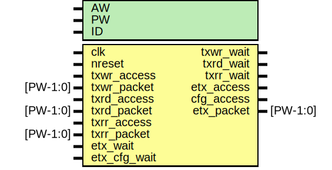

# Entity: etx_arbiter

- **File**: etx_arbiter.v
## Diagram

## Description

## Generics

| Generic name | Type | Value   | Description |
| ------------ | ---- | ------- | ----------- |
| AW           |      | 32      |             |
| PW           |      | 2*AW+40 |             |
| ID           |      | 0       |             |
## Ports

| Port name    | Direction | Type     | Description                 |
| ------------ | --------- | -------- | --------------------------- |
| clk          | input     |          | tx clock and reset          |
| nreset       | input     |          |                             |
| txwr_access  | input     |          | Write Request (from slave)  |
| txwr_packet  | input     | [PW-1:0] |                             |
| txwr_wait    | output    |          |                             |
| txrd_access  | input     |          | Read Request (from slave)   |
| txrd_packet  | input     | [PW-1:0] |                             |
| txrd_wait    | output    |          |                             |
| txrr_access  | input     |          | Read Response (from master) |
| txrr_packet  | input     | [PW-1:0] |                             |
| txrr_wait    | output    |          |                             |
| etx_wait     | input     |          | Wait signal inputs          |
| etx_cfg_wait | input     |          |                             |
| etx_access   | output    |          | for IO                      |
| cfg_access   | output    |          | for RX/RX configuration     |
| etx_packet   | output    | [PW-1:0] |                             |
## Signals

| Name           | Type          | Description    |
| -------------- | ------------- | -------------- |
| etx_access     | reg           | regs           |
| etx_packet     | reg [PW-1:0]  |                |
| cfg_access     | reg           | config access  |
| cfg_packet     | reg [PW-1:0]  | config packet  |
| txrd_ctrlmode  | wire [3:0]    | wires          |
| txwr_ctrlmode  | wire [3:0]    |                |
| access_in      | wire          |                |
| etx_packet_mux | wire [PW-1:0] |                |
| txrr_grant     | wire          |                |
| txrd_grant     | wire          |                |
| txwr_grant     | wire          |                |
| etx_mux        | wire [PW-1:0] |                |
| dstaddr_mux    | wire [31:0]   |                |
## Processes
- unnamed: ( @ (posedge clk) )
  - **Type:** always
 **Description**
access decode 
- unnamed: ( @ (posedge clk) )
  - **Type:** always
 **Description**
config access 
- unnamed: ( @ (posedge clk) )
  - **Type:** always
 **Description**
packet 
## Instantiations

- arbiter: oh_arbiter
 **Description**
########################################################################
# Arbiter
########################################################################
TODO: change to round robin!!! (live lock hazard)

