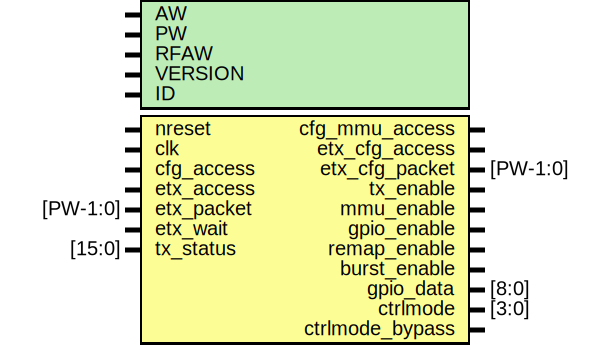

# Entity: etx_cfg

- **File**: etx_cfg.v
## Diagram

## Description

########################################################################
# ELINK TX CONFIGURATION REGISTER FILE
######################################################################## 

## Generics

| Generic name | Type | Value    | Description                                                                                                                                                   |
| ------------ | ---- | -------- | ------------------------------------------------------------------------------------------------------------------------------------------------------------- |
| AW           |      | 32       | ################################################################## # INTERFACE ################################################################## parameters  |
| PW           |      | 2*AW+40  |                                                                                                                                                               |
| RFAW         |      | 6        |                                                                                                                                                               |
| VERSION      |      | 16'h0000 |                                                                                                                                                               |
| ID           |      | 999      |                                                                                                                                                               |
## Ports

| Port name       | Direction | Type     | Description                            |
| --------------- | --------- | -------- | -------------------------------------- |
| nreset          | input     |          | sync reset                             |
| clk             | input     |          | slow clock                             |
| cfg_access      | input     |          | register access                        |
| etx_access      | input     |          | for transaction counter                |
| etx_packet      | input     | [PW-1:0] | for transaction sampler                |
| etx_wait        | input     |          | wait signal                            |
| cfg_mmu_access  | output    |          | mmu access                             |
| etx_cfg_access  | output    |          | access for rx (write or rdata forward) |
| etx_cfg_packet  | output    | [PW-1:0] | packet                                 |
| tx_enable       | output    |          | enable signal for TX                   |
| mmu_enable      | output    |          | enables MMU on transmit path           |
| gpio_enable     | output    |          | forces TX output pins to constants     |
| remap_enable    | output    |          | enable address remapping               |
| burst_enable    | output    |          | enables bursting                       |
| gpio_data       | output    | [8:0]    | data for elink outputs (static)        |
| ctrlmode        | output    | [3:0]    | value for emesh ctrlmode tag           |
| ctrlmode_bypass | output    |          | selects ctrlmode                       |
| tx_status       | input     | [15:0]   | tx status signals                      |
## Signals

| Name           | Type          | Description                                                                                                                                                   |
| -------------- | ------------- | ------------------------------------------------------------------------------------------------------------------------------------------------------------- |
| tx_version_reg | reg [15:0]    | ################################################################## # BODY ################################################################## registers/wires  |
| tx_cfg_reg     | reg [15:0]    |                                                                                                                                                               |
| tx_gpio_reg    | reg [8:0]     |                                                                                                                                                               |
| tx_status_reg  | reg [15:0]    |                                                                                                                                                               |
| tx_monitor_reg | reg [31:0]    |                                                                                                                                                               |
| tx_packet_reg  | reg [31:0]    |                                                                                                                                                               |
| cfg_dout       | reg [31:0]    |                                                                                                                                                               |
| ecfg_access    | reg           |                                                                                                                                                               |
| datamode_out   | reg [1:0]     |                                                                                                                                                               |
| ctrlmode_out   | reg [4:0]     |                                                                                                                                                               |
| write_out      | reg           |                                                                                                                                                               |
| dstaddr_out    | reg [AW-1:0]  |                                                                                                                                                               |
| srcaddr_out    | reg [AW-1:0]  |                                                                                                                                                               |
| data_out       | reg [AW-1:0]  |                                                                                                                                                               |
| read_sel       | reg           |                                                                                                                                                               |
| etx_cfg_access | reg           |                                                                                                                                                               |
| tx_status_sync | wire [15:0]   |                                                                                                                                                               |
| data_mux       | wire [31:0]   |                                                                                                                                                               |
| ctrlmode_in    | wire [4:0]    | From p2e of packet2emesh.v                                                                                                                                    |
| data_in        | wire [AW-1:0] | From p2e of packet2emesh.v                                                                                                                                    |
| datamode_in    | wire [1:0]    | From p2e of packet2emesh.v                                                                                                                                    |
| dstaddr_in     | wire [AW-1:0] | From p2e of packet2emesh.v                                                                                                                                    |
| srcaddr_in     | wire [AW-1:0] | From p2e of packet2emesh.v                                                                                                                                    |
| write_in       | wire          | From p2e of packet2emesh.v                                                                                                                                    |
## Processes
- unnamed: ( @ (posedge clk) )
  - **Type:** always
 **Description**
########################### # TX CONFIG ########################### 
- unnamed: ( @ (posedge clk) )
  - **Type:** always
- unnamed: ( @ (posedge clk) )
  - **Type:** always
 **Description**
########################### # GPIO DATA ########################### 
- unnamed: ( @ (posedge clk) )
  - **Type:** always
 **Description**
########################### # VERSION ########################### 
- unnamed: ( @ (posedge clk) )
  - **Type:** always
 **Description**
########################### # MONITOR ########################### 
- unnamed: ( @ (posedge clk) )
  - **Type:** always
 **Description**
########################### # PACKET (FOR DEBUG) ###########################      
- unnamed: ( @ (posedge clk) )
  - **Type:** always
 **Description**
############################### # DATA READBACK MUX ############################### Pipelineing readback 
- unnamed: ( @ (posedge clk) )
  - **Type:** always
 **Description**
########################### # FORWARD PACKET TO RX ########################### pipeline 
## Instantiations

- isync[15:0]: oh_dsync
 **Description**
###########################
# STATUS REGISTER
###########################   
Synchronize to make easy regular

