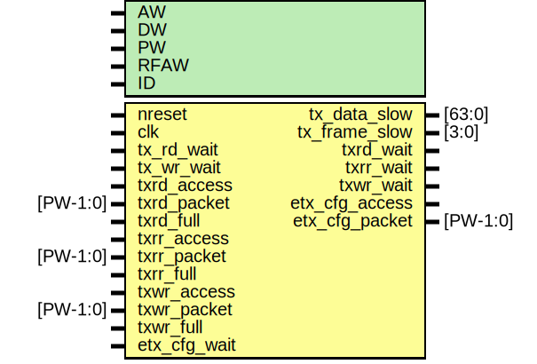

# Entity: etx_core

- **File**: etx_core.v
## Diagram

## Generics

| Generic name | Type | Value   | Description |
| ------------ | ---- | ------- | ----------- |
| AW           |      | 32      |             |
| DW           |      | 32      |             |
| PW           |      | 104     |             |
| RFAW         |      | 6       |             |
| ID           |      | 12'h999 |             |
## Ports

| Port name      | Direction | Type     | Description                       |
| -------------- | --------- | -------- | --------------------------------- |
| nreset         | input     |          | Clocks,reset,config               |
| clk            | input     |          |                                   |
| tx_data_slow   | output    | [63:0]   | IO interface                      |
| tx_frame_slow  | output    | [3:0]    |                                   |
| tx_rd_wait     | input     |          |                                   |
| tx_wr_wait     | input     |          |                                   |
| txrd_access    | input     |          | TXRD                              |
| txrd_packet    | input     | [PW-1:0] |                                   |
| txrd_wait      | output    |          |                                   |
| txrd_full      | input     |          | sysclk domain                     |
| txrr_access    | input     |          | TXRR                              |
| txrr_packet    | input     | [PW-1:0] |                                   |
| txrr_wait      | output    |          |                                   |
| txrr_full      | input     |          | sysclk domain                     |
| txwr_access    | input     |          | TXWR                              |
| txwr_packet    | input     | [PW-1:0] |                                   |
| txwr_wait      | output    |          |                                   |
| txwr_full      | input     |          | sysclk domain                     |
| etx_cfg_access | output    |          | Configuration Interface (for ERX) |
| etx_cfg_packet | output    | [PW-1:0] |                                   |
| etx_cfg_wait   | input     |          |                                   |
## Signals

| Name             | Type          | Description                          |
| ---------------- | ------------- | ------------------------------------ |
| tx_status        | wire [15:0]   | for status?                          |
| burst_enable     | wire          | From etx_cfg of etx_cfg.v            |
| cfg_access       | wire          | From etx_arbiter of etx_arbiter.v    |
| cfg_mmu_access   | wire          | From etx_cfg of etx_cfg.v            |
| ctrlmode         | wire [3:0]    | From etx_cfg of etx_cfg.v            |
| ctrlmode_bypass  | wire          | From etx_cfg of etx_cfg.v            |
| emmu_access      | wire          | From etx_mmu of emmu.v               |
| emmu_packet      | wire [PW-1:0] | From etx_mmu of emmu.v               |
| etx_access       | wire          | From etx_arbiter of etx_arbiter.v    |
| etx_packet       | wire [PW-1:0] | From etx_arbiter of etx_arbiter.v    |
| etx_rd_wait      | wire          | From etx_protocol of etx_protocol.v  |
| etx_remap_access | wire          | From etx_remap of etx_remap.v        |
| etx_remap_packet | wire [PW-1:0] | From etx_remap of etx_remap.v        |
| etx_wait         | wire          | From etx_protocol of etx_protocol.v  |
| etx_wr_wait      | wire          | From etx_protocol of etx_protocol.v  |
| gpio_data        | wire [8:0]    | From etx_cfg of etx_cfg.v            |
| gpio_enable      | wire          | From etx_cfg of etx_cfg.v            |
| mmu_enable       | wire          | From etx_cfg of etx_cfg.v            |
| remap_enable     | wire          | From etx_cfg of etx_cfg.v            |
| tx_access        | wire          | From etx_protocol of etx_protocol.v  |
| tx_burst         | wire          | From etx_protocol of etx_protocol.v  |
| tx_enable        | wire          | From etx_cfg of etx_cfg.v            |
