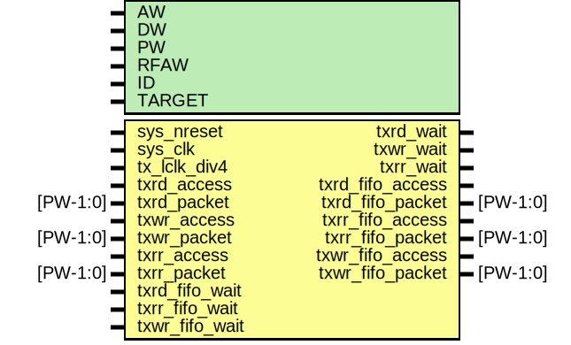

# Entity: etx_fifo

- **File**: etx_fifo.v
## Diagram

## Generics

| Generic name | Type | Value     | Description |
| ------------ | ---- | --------- | ----------- |
| AW           |      | 32        |             |
| DW           |      | 32        |             |
| PW           |      | 104       |             |
| RFAW         |      | 6         |             |
| ID           |      | 12'h000   |             |
| TARGET       |      | "GENERIC" |             |
## Ports

| Port name        | Direction | Type     | Description                 |
| ---------------- | --------- | -------- | --------------------------- |
| sys_nreset       | input     |          | Clocks,reset,config         |
| sys_clk          | input     |          |                             |
| tx_lclk_div4     | input     |          | slow speed parallel clock   |
| txrd_access      | input     |          | Read Request Channel Input  |
| txrd_packet      | input     | [PW-1:0] |                             |
| txrd_wait        | output    |          |                             |
| txwr_access      | input     |          | Write Channel Input         |
| txwr_packet      | input     | [PW-1:0] |                             |
| txwr_wait        | output    |          |                             |
| txrr_access      | input     |          | Read Response Channel Input |
| txrr_packet      | input     | [PW-1:0] |                             |
| txrr_wait        | output    |          |                             |
| txrd_fifo_access | output    |          | Read request for pins       |
| txrd_fifo_packet | output    | [PW-1:0] |                             |
| txrd_fifo_wait   | input     |          |                             |
| txrr_fifo_access | output    |          | Read response for pins      |
| txrr_fifo_packet | output    | [PW-1:0] |                             |
| txrr_fifo_wait   | input     |          |                             |
| txwr_fifo_access | output    |          | Write for pins              |
| txwr_fifo_packet | output    | [PW-1:0] |                             |
| txwr_fifo_wait   | input     |          |                             |
