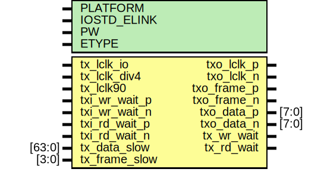

# Entity: etx_io

- **File**: etx_io.v
## Diagram

## Generics

| Generic name | Type | Value         | Description      |
| ------------ | ---- | ------------- | ---------------- |
| PLATFORM     |      | `CFG_PLATFORM |                  |
| IOSTD_ELINK  |      | "LVDS_25"     |                  |
| PW           |      | 104           |                  |
| ETYPE        |      | 0             |  0 = parallella  |
## Ports

| Port name      | Direction | Type   | Description                   |
| -------------- | --------- | ------ | ----------------------------- |
| tx_lclk_io     | input     |        | fast ODDR                     |
| tx_lclk_div4   | input     |        | slow clock                    |
| tx_lclk90      | input     |        | fast 90deg shifted lclk       |
| txo_lclk_p     | output    |        | tx clock output               |
| txo_lclk_n     | output    |        | tx clock output               |
| txo_frame_p    | output    |        | tx frame signal               |
| txo_frame_n    | output    |        | tx frame signal               |
| txo_data_p     | output    | [7:0]  | tx data (dual data rate)      |
|  txo_data_n    | output    | [7:0]  | tx data (dual data rate)      |
| txi_wr_wait_p  | input     |        | tx write pushback             |
| txi_wr_wait_n  | input     |        | tx write pushback             |
| txi_rd_wait_p  | input     |        | tx read pushback              |
|  txi_rd_wait_n | input     |        | tx read pushback              |
| tx_data_slow   | input     | [63:0] | data for burst or transaction |
| tx_frame_slow  | input     | [3:0]  | framing signal                |
| tx_wr_wait     | output    |        |                               |
| tx_rd_wait     | output    |        |                               |
## Signals

| Name             | Type        | Description                        |
| ---------------- | ----------- | ---------------------------------- |
| tx_data          | reg [63:0]  | ############ # REGS ############   |
| tx_frame         | reg [3:0]   |                                    |
| tx_data16        | wire [15:0] |                                    |
| tx_frame16       | wire        |                                    |
| tx_wr_wait_sync  | reg         |                                    |
| tx_rd_wait_sync  | reg         |                                    |
| tx_wr_wait_reg   | reg         |                                    |
| tx_rd_wait_reg   | reg         |                                    |
| tx_wr_wait_reg2  | reg         |                                    |
| tx_rd_wait_reg2  | reg         |                                    |
| tx_data_mux      | wire [15:0] | ############ # WIRES ############  |
| txo_frame_ddr    | wire        |                                    |
| txo_lclk90       | wire        |                                    |
| tx_wr_wait_async | wire        |                                    |
| tx_rd_wait_async | wire        |                                    |
| txo_data_ddr     | wire [7:0]  |                                    |
| invert_pins      | wire        |                                    |
## Processes
- unnamed: ( @ (posedge tx_lclk_io) )
  - **Type:** always
 **Description**
Data shift registers 
- unnamed: ( @ (negedge tx_lclk_io) )
  - **Type:** always
 **Description**
############################################## # Wait signal synchronization ##############################################  
- unnamed: ( @ (posedge tx_lclk_div4) )
  - **Type:** always
 **Description**
Looks like legacy elink puts out short wait pulses. Let's make sure they don't sneak through 
## Instantiations

- edgealign0: oh_edgealign
 **Description**
#########################################
# Synchronizatsion to fast domain
#########################################        
Find the aligned edge

- obufds_data[7:0]: OBUFDS
 **Description**
Buffer drivers

- obufds_frame: OBUFDS
- obufds_lclk: OBUFDS
- ibufds_rdwait: IBUFDS
