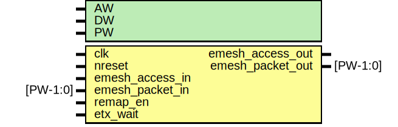

# Entity: etx_remap

- **File**: etx_remap.v
## Diagram

## Generics

| Generic name | Type | Value | Description |
| ------------ | ---- | ----- | ----------- |
| AW           |      | 32    |             |
| DW           |      | 32    |             |
| PW           |      | 104   |             |
## Ports

| Port name        | Direction | Type     | Description                      |
| ---------------- | --------- | -------- | -------------------------------- |
| clk              | input     |          | Clock                            |
| nreset           | input     |          |                                  |
| emesh_access_in  | input     |          | Input from arbiter               |
| emesh_packet_in  | input     | [PW-1:0] |                                  |
| remap_en         | input     |          | enable tx remap (static)         |
| emesh_access_out | output    |          | Output to TX IO                  |
| emesh_packet_out | output    | [PW-1:0] |                                  |
| etx_wait         | input     |          | Wait signals from protocol block |
## Signals

| Name             | Type         | Description |
| ---------------- | ------------ | ----------- |
| addr_in          | wire [31:0]  |             |
| addr_remap       | wire [31:0]  |             |
| addr_out         | wire [31:0]  |             |
| write_in         | wire         |             |
| emesh_access_out | reg          |             |
| emesh_packet_out | reg [PW-1:0] |             |
## Processes
- unnamed: ( @ (posedge clk) )
  - **Type:** always
 **Description**
stall read/write access appropriately 
- unnamed: ( @ (posedge clk) )
  - **Type:** always
