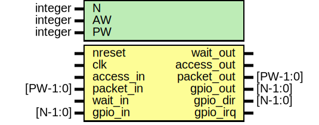

# Entity: gpio

- **File**: gpio.v
## Diagram

## Description

#############################################################################
# Function: General Purpose Software Programmable IO                        #
#           (See README.md for complete documentation)                      #
#############################################################################
# Author:   Andreas Olofsson                                                #
# License:  MIT (see LICENSE file in this repository)                       # 
#############################################################################

## Generics

| Generic name | Type    | Value | Description                  |
| ------------ | ------- | ----- | ---------------------------- |
| N            | integer | 24    |  number of gpio pins         |
| AW           | integer | 32    |  architecture address width  |
| PW           | integer | 104   |  packet width                |
## Ports

| Port name  | Direction | Type     | Description                   |
| ---------- | --------- | -------- | ----------------------------- |
| nreset     | input     |          | asynchronous active low reset |
| clk        | input     |          | clock                         |
| access_in  | input     |          | register access               |
| packet_in  | input     | [PW-1:0] | data/address                  |
| wait_out   | output    |          | pushback from mesh            |
| access_out | output    |          | register access               |
| packet_out | output    | [PW-1:0] | data/address                  |
| wait_in    | input     |          | pushback from mesh            |
| gpio_out   | output    | [N-1:0]  | data to drive to IO pins      |
| gpio_dir   | output    | [N-1:0]  | gpio direction(0=input)       |
| gpio_in    | input     | [N-1:0]  | data from IO pins             |
| gpio_irq   | output    |          | OR of GPIO_ILAT register      |
## Signals

| Name          | Type          | Description                                                                                         |
| ------------- | ------------- | --------------------------------------------------------------------------------------------------- |
| gpio_imask    | reg [N-1:0]   | ################################ # wires/regs/ params ################################   registers  |
| gpio_itype    | reg [N-1:0]   |                                                                                                     |
| gpio_ipol     | reg [N-1:0]   |                                                                                                     |
| gpio_ilat     | reg [N-1:0]   |                                                                                                     |
| read_data     | reg [N-1:0]   |                                                                                                     |
| gpio_in_sync  | wire [N-1:0]  |                                                                                                     |
| data_old      | reg [N-1:0]   | shadow                                                                                              |
| ilat_clr      | wire [N-1:0]  |                                                                                                     |
| reg_wdata     | wire [N-1:0]  |                                                                                                     |
| out_dmux      | wire [N-1:0]  |                                                                                                     |
| rising_edge   | wire [N-1:0]  |                                                                                                     |
| falling_edge  | wire [N-1:0]  |                                                                                                     |
| irq_event     | wire [N-1:0]  |                                                                                                     |
| reg_write     | wire          |                                                                                                     |
| reg_read      | wire          |                                                                                                     |
| reg_double    | wire          |                                                                                                     |
| dir_write     | wire          |                                                                                                     |
| imask_write   | wire          |                                                                                                     |
| itype_write   | wire          |                                                                                                     |
| ipol_write    | wire          |                                                                                                     |
| ilatclr_write | wire          |                                                                                                     |
| out_write     | wire          |                                                                                                     |
| outset_write  | wire          |                                                                                                     |
| outclr_write  | wire          |                                                                                                     |
| outxor_write  | wire          |                                                                                                     |
| outreg_write  | wire          |                                                                                                     |
| ctrlmode_in   | wire [4:0]    | From p2e of packet2emesh.v                                                                          |
| data_in       | wire [AW-1:0] | From p2e of packet2emesh.v                                                                          |
| datamode_in   | wire [1:0]    | From p2e of packet2emesh.v                                                                          |
| dstaddr_in    | wire [AW-1:0] | From p2e of packet2emesh.v                                                                          |
| srcaddr_in    | wire [AW-1:0] | From p2e of packet2emesh.v                                                                          |
| write_in      | wire          | From p2e of packet2emesh.v                                                                          |
## Processes
- unnamed: ( @ (posedge clk or negedge nreset) )
  - **Type:** always
 **Description**
################################ # GPIO_DIR  ################################  0=input 1=output 
- unnamed: ( @ (posedge clk) )
  - **Type:** always
- unnamed: ( @ (posedge clk or negedge nreset) )
  - **Type:** always
- unnamed: ( @ (posedge clk or negedge nreset) )
  - **Type:** always
 **Description**
################################ # GPIO_IMASK ################################  
- unnamed: ( @ (posedge clk) )
  - **Type:** always
 **Description**
################################ # GPIO_ITYPE ################################  
- unnamed: ( @ (posedge clk) )
  - **Type:** always
 **Description**
################################ # GPIO_IPOL ################################  
- unnamed: ( @ (posedge clk or negedge nreset) )
  - **Type:** always
- unnamed: ( @ (posedge clk) )
  - **Type:** always
 **Description**
################################ # READBACK ################################  
