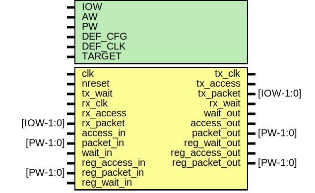

# Entity: mio

- **File**: mio.v
## Diagram

## Description

#############################################################################
# Purpose: "Mini-IO" (MIO)                                                  #
#############################################################################
# Author:   Andreas Olofsson                                                #
# License:  MIT (see LICENSE file in OH! repository)                        # 
#############################################################################

## Generics

| Generic name | Type | Value     | Description                          |
| ------------ | ---- | --------- | ------------------------------------ |
| IOW          |      | 64        |  IO width                            |
| AW           |      | 32        |  address width                       |
| PW           |      | 104       |  emesh packet width                  |
| DEF_CFG      |      | 18'h0010  |  default config                      |
| DEF_CLK      |      | 7         |  clock divider                       |
| TARGET       |      | "GENERIC" |  GENERIC,XILINX,ALTERA,GENERIC,ASIC  |
## Ports

| Port name      | Direction | Type      | Description               |
| -------------- | --------- | --------- | ------------------------- |
| clk            | input     |           | main core clock           |
| nreset         | input     |           | async active low reset    |
| tx_clk         | output    |           | phase shited io_clk       |
| tx_access      | output    |           | access signal for IO      |
| tx_packet      | output    | [IOW-1:0] | packet for IO             |
| tx_wait        | input     |           | pushback from IO          |
| rx_clk         | input     |           | rx clock                  |
| rx_access      | input     |           | rx access                 |
| rx_packet      | input     | [IOW-1:0] | rx packet                 |
| rx_wait        | output    |           | pushback from IO          |
| access_in      | input     |           | access for tx             |
| packet_in      | input     | [PW-1:0]  | access for tx             |
| wait_out       | output    |           | access from tx fifo       |
| access_out     | output    |           | access from rx            |
| packet_out     | output    | [PW-1:0]  | packet from rx            |
| wait_in        | input     |           | pushback for rx fifo      |
| reg_access_in  | input     |           | config register access    |
| reg_packet_in  | input     | [PW-1:0]  | config register packet    |
| reg_wait_out   | output    |           | pushback by register read |
| reg_access_out | output    |           | config readback           |
| reg_packet_out | output    | [PW-1:0]  | config reacback packet    |
| reg_wait_in    | input     |           | pushback for readback     |
## Signals

| Name         | Type          | Description                  |
| ------------ | ------------- | ---------------------------- |
| io_clk       | wire          |  local wires                 |
| amode        | wire          | From mio_regs of mio_regs.v  |
| clkchange    | wire          | From mio_regs of mio_regs.v  |
| clkdiv       | wire [7:0]    | From mio_regs of mio_regs.v  |
| clkphase0    | wire [15:0]   | From mio_regs of mio_regs.v  |
| clkphase1    | wire [15:0]   | From mio_regs of mio_regs.v  |
| ctrlmode     | wire [4:0]    | From mio_regs of mio_regs.v  |
| datamode     | wire [1:0]    | From mio_regs of mio_regs.v  |
| ddr_mode     | wire          | From mio_regs of mio_regs.v  |
| dmode        | wire          | From mio_regs of mio_regs.v  |
| dstaddr      | wire [AW-1:0] | From mio_regs of mio_regs.v  |
| emode        | wire          | From mio_regs of mio_regs.v  |
| framepol     | wire          | From mio_regs of mio_regs.v  |
| iowidth      | wire [1:0]    | From mio_regs of mio_regs.v  |
| lsbfirst     | wire          | From mio_regs of mio_regs.v  |
| rx_empty     | wire          | From mrx of mrx.v            |
| rx_en        | wire          | From mio_regs of mio_regs.v  |
| rx_full      | wire          | From mrx of mrx.v            |
| rx_prog_full | wire          | From mrx of mrx.v            |
| tx_empty     | wire          | From mtx of mtx.v            |
| tx_en        | wire          | From mio_regs of mio_regs.v  |
| tx_full      | wire          | From mtx of mtx.v            |
| tx_prog_full | wire          | From mtx of mtx.v            |
## Instantiations

- oh_clockdiv: oh_clockdiv
 **Description**
################################
# TX CLOCK DRIVER
################################

