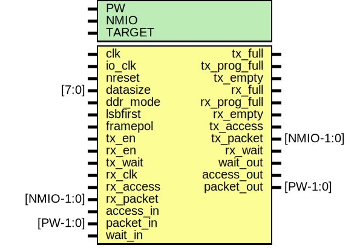

# Entity: mio_dp

- **File**: mio_dp.v
## Diagram

## Generics

| Generic name | Type | Value     | Description                          |
| ------------ | ---- | --------- | ------------------------------------ |
| PW           |      | 104       |  data width (core)                   |
| NMIO         |      | 8         |  Mini IO width                       |
| TARGET       |      | "GENERIC" |  GENERIC,XILINX,ALTERA,GENERIC,ASIC  |
## Ports

| Port name    | Direction | Type       | Description              |
| ------------ | --------- | ---------- | ------------------------ |
| clk          | input     |            | main core clock          |
| io_clk       | input     |            | clock for TX             |
| nreset       | input     |            | async active low reset   |
| datasize     | input     | [7:0]      | size of data transmitted |
| ddr_mode     | input     |            | dual data rate mode      |
| lsbfirst     | input     |            | send data lsbfirst       |
| framepol     | input     |            | polarity of frame signal |
| tx_en        | input     |            | enable transmit          |
| rx_en        | input     |            | enable receive           |
| tx_full      | output    |            |  status                  |
| tx_prog_full | output    |            |                          |
| tx_empty     | output    |            |                          |
| rx_full      | output    |            |                          |
| rx_prog_full | output    |            |                          |
| rx_empty     | output    |            |                          |
| tx_access    | output    |            | access signal for IO     |
| tx_packet    | output    | [NMIO-1:0] | packet for IO            |
| tx_wait      | input     |            | pushback from IO         |
| rx_clk       | input     |            | rx clock                 |
| rx_access    | input     |            | rx access                |
| rx_packet    | input     | [NMIO-1:0] | rx packet                |
| rx_wait      | output    |            | pushback from IO         |
| access_in    | input     |            | fifo data valid          |
| packet_in    | input     | [PW-1:0]   | fifo packet              |
| wait_out     | output    |            | wait pushback for fifo   |
| access_out   | output    |            | fifo data valid          |
| packet_out   | output    | [PW-1:0]   | fifo packet              |
| wait_in      | input     |            | wait pushback for fifo   |
