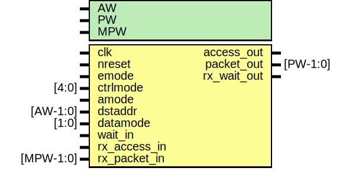

# Entity: mio_if

- **File**: mio_if.v
## Diagram

## Generics

| Generic name | Type | Value | Description                 |
| ------------ | ---- | ----- | --------------------------- |
| AW           |      | 32    |  address width              |
| PW           |      | 104   |  emesh packet width         |
| MPW          |      | 128   |  mio packet width  (> PW)   |
## Ports

| Port name    | Direction | Type      | Description               |
| ------------ | --------- | --------- | ------------------------- |
| clk          | input     |           | main core clock           |
| nreset       | input     |           | async active low reset    |
| emode        | input     |           | emesh mode                |
| ctrlmode     | input     | [4:0]     | emode ctrlmode            |
| amode        | input     |           | auto address mode         |
| dstaddr      | input     | [AW-1:0]  | amode destination address |
| datamode     | input     | [1:0]     | amode datamode            |
| access_out   | output    |           | pass through              |
| packet_out   | output    | [PW-1:0]  | packet for core from rx   |
| wait_in      | input     |           | pass through              |
| rx_access_in | input     |           | pass through              |
| rx_packet_in | input     | [MPW-1:0] | packet from rx fifo       |
| rx_wait_out  | output    |           | pass through              |
## Signals

| Name         | Type          | Description                                                                                                                                         |
| ------------ | ------------- | --------------------------------------------------------------------------------------------------------------------------------------------------- |
| ctrlmode_out | wire [4:0]    | ##################################################################### # BODY #####################################################################  |
| data_out     | wire [AW-1:0] |                                                                                                                                                     |
| datamode_out | wire [1:0]    |                                                                                                                                                     |
| dstaddr_out  | wire [AW-1:0] |                                                                                                                                                     |
| srcaddr_out  | wire [AW-1:0] |                                                                                                                                                     |
| write_out    | wire          |                                                                                                                                                     |
| datamode     | wire [1:0]    |                                                                                                                                                     |
| addr_stride  | wire [3:0]    |                                                                                                                                                     |
| ctrlmode_in  | wire [4:0]    | From pe2 of packet2emesh.v                                                                                                                          |
| data_in      | wire [AW-1:0] | From pe2 of packet2emesh.v                                                                                                                          |
| datamode_in  | wire [1:0]    | From pe2 of packet2emesh.v                                                                                                                          |
| dstaddr_in   | wire [AW-1:0] | From pe2 of packet2emesh.v                                                                                                                          |
| srcaddr_in   | wire [AW-1:0] | From pe2 of packet2emesh.v                                                                                                                          |
| write_in     | wire          | From pe2 of packet2emesh.v                                                                                                                          |
| datasize     | wire [3:0]    |  End of automatics AUTOINPUT*/                                                                                                                      |
