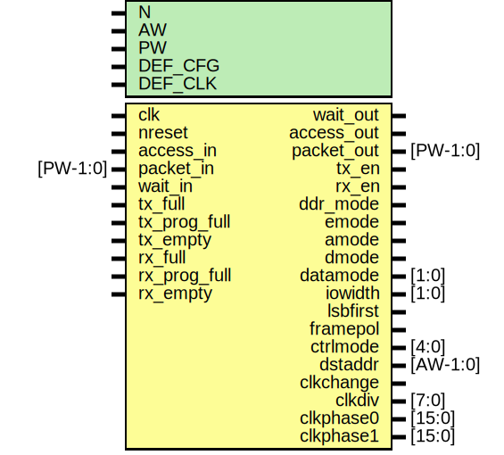

# Entity: mio_regs

- **File**: mio_regs.v
## Diagram

## Description

#############################################################################
# Function: MIO Configuration Registers                                     #
#           (See README.md for complete documentation)                      #
#############################################################################
# Author:   Andreas Olofsson                                                #
# License:  MIT (see LICENSE file in this repository)                       # 
#############################################################################

## Generics

| Generic name | Type | Value    | Description            |
| ------------ | ---- | -------- | ---------------------- |
| N            |      | 8        |  number of I/O pins    |
| AW           |      | 32       |  address width         |
| PW           |      | 104      |  packet width          |
| DEF_CFG      |      | 18'h1070 |  default config        |
| DEF_CLK      |      | 7        |  clock divider         |
## Ports

| Port name    | Direction | Type     | Description                          |
| ------------ | --------- | -------- | ------------------------------------ |
| clk          | input     |          |  clk,reset                           |
| nreset       | input     |          |                                      |
| access_in    | input     |          | incoming access                      |
| packet_in    | input     | [PW-1:0] | incoming packet                      |
| wait_out     | output    |          |                                      |
| access_out   | output    |          | outgoing read packet                 |
| packet_out   | output    | [PW-1:0] | outgoing read packet                 |
| wait_in      | input     |          |                                      |
| tx_en        | output    |          | enable tx                            |
| rx_en        | output    |          | enable rx                            |
| ddr_mode     | output    |          | ddr mode for mio                     |
| emode        | output    |          | epiphany packet mode                 |
| amode        | output    |          | mio packet mode                      |
| dmode        | output    |          | mio packet mode                      |
| datamode     | output    | [1:0]    | mio datasize                         |
| iowidth      | output    | [1:0]    | mio io width                         |
| lsbfirst     | output    |          | lsb shift first                      |
| framepol     | output    |          | framepolarity (0=actrive high)       |
| ctrlmode     | output    | [4:0]    | emode ctrlmode                       |
| dstaddr      | output    | [AW-1:0] | destination address for RX dmode     |
| clkchange    | output    |          | indicates a clock change             |
| clkdiv       | output    | [7:0]    | mio clk clock setting                |
| clkphase0    | output    | [15:0]   | [7:0]=rising,[15:8]=falling          |
| clkphase1    | output    | [15:0]   | [7:0]=rising,[15:8]=falling          |
| tx_full      | input     |          | tx fifo is full (should not happen!) |
| tx_prog_full | input     |          | tx fifo is nearing full              |
| tx_empty     | input     |          | tx fifo is empty                     |
| rx_full      | input     |          | rx fifo is full (should not happen!) |
| rx_prog_full | input     |          | rx fifo is nearing full              |
| rx_empty     | input     |          | rx fifo is empty                     |
## Signals

| Name           | Type          | Description                 |
| -------------- | ------------- | --------------------------- |
| status_reg     | reg [15:0]    |                             |
| clkdiv_reg     | reg [31:0]    |                             |
| addr_reg       | reg [63:0]    |                             |
| clkphase_reg   | reg [31:0]    |                             |
| status_in      | wire [7:0]    |                             |
| reg_write      | wire          |                             |
| config_write   | wire          |                             |
| status_write   | wire          |                             |
| clkdiv_write   | wire          |                             |
| clkphase_write | wire          |                             |
| idelay_write   | wire          |                             |
| odelay_write   | wire          |                             |
| addr0_write    | wire          |                             |
| addr1_write    | wire          |                             |
| ctrlmode_in    | wire [4:0]    | From p2e of packet2emesh.v  |
| data_in        | wire [AW-1:0] | From p2e of packet2emesh.v  |
| datamode_in    | wire [1:0]    | From p2e of packet2emesh.v  |
| dstaddr_in     | wire [AW-1:0] | From p2e of packet2emesh.v  |
| srcaddr_in     | wire [AW-1:0] | From p2e of packet2emesh.v  |
| write_in       | wire          | From p2e of packet2emesh.v  |
## Constants

| Name      | Type | Value     | Description  |
| --------- | ---- | --------- | ------------ |
| DEF_RISE0 |      | 0         | 0 degrees    |
| DEF_FALL0 |      | undefined | 180 degrees  |
| DEF_RISE1 |      | undefined | 90 degrees   |
| DEF_FALL1 |      |           |              |
## Processes
- unnamed: ( @ (posedge clk or negedge nreset) )
  - **Type:** always
 **Description**
################################ # CONFIG ################################  
- unnamed: ( @ (posedge clk or negedge nreset) )
  - **Type:** always
- unnamed: ( @ (posedge clk or negedge nreset) )
  - **Type:** always
 **Description**
 immediate bits ############################### # CLKDIV ################################  
- unnamed: ( @ (posedge clk or negedge nreset) )
  - **Type:** always
 **Description**
############################### # CLKPHASE ################################  
- unnamed: ( @ (posedge clk) )
  - **Type:** always
 **Description**
############################### # RX DESTINATION ADDR ("AMODE") ################################  
