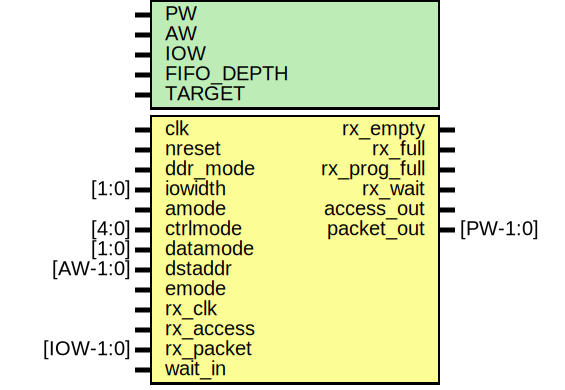

# Entity: mrx

- **File**: mrx.v
## Diagram

## Description

#############################################################################
# Purpose: MIO Receive Datapath                                             #
#############################################################################
# Author:   Andreas Olofsson                                                #
# License:  MIT (see LICENSE file in OH! repository)                        # 
#############################################################################

## Generics

| Generic name | Type | Value     | Description       |
| ------------ | ---- | --------- | ----------------- |
| PW           |      | 104       |  fifo width       |
| AW           |      | 32        |  fifo width       |
| IOW          |      | 8         |  I./O data width  |
| FIFO_DEPTH   |      | 16        |  fifo depth       |
| TARGET       |      | "GENERIC" |  fifo target      |
## Ports

| Port name    | Direction | Type      | Description                            |
| ------------ | --------- | --------- | -------------------------------------- |
| clk          | input     |           | main core clock                        |
| nreset       | input     |           | async active low reset                 |
| ddr_mode     | input     |           |                                        |
| iowidth      | input     | [1:0]     |                                        |
| amode        | input     |           | To mrx_fifo of mrx_fifo.v              |
| ctrlmode     | input     | [4:0]     | To mrx_fifo of mrx_fifo.v              |
| datamode     | input     | [1:0]     | To mrx_fifo of mrx_fifo.v              |
| dstaddr      | input     | [AW-1:0]  | To mrx_fifo of mrx_fifo.v              |
| emode        | input     |           | To mrx_fifo of mrx_fifo.v              |
| rx_empty     | output    |           | rx fifo is empty                       |
| rx_full      | output    |           | rx fifo is full (should never happen!) |
| rx_prog_full | output    |           | rx is getting full (stop sending!)     |
| rx_clk       | input     |           | clock from IO                          |
| rx_access    | input     |           | access signal for IO                   |
| rx_packet    | input     | [IOW-1:0] | packet from IO                         |
| rx_wait      | output    |           | pushback for IO                        |
| access_out   | output    |           | fifo data valid                        |
| packet_out   | output    | [PW-1:0]  | fifo packet                            |
| wait_in      | input     |           | wait pushback for fifo                 |
## Signals

| Name      | Type        | Description              |
| --------- | ----------- | ------------------------ |
| io_access | wire        | From mrx_io of mrx_io.v  |
| io_packet | wire [63:0] | From mrx_io of mrx_io.v  |
| io_valid  | wire [7:0]  | From mrx_io of mrx_io.v  |
