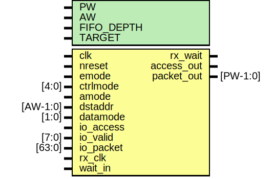

# Entity: mrx_fifo

- **File**: mrx_fifo.v
## Diagram

## Description

#############################################################################
# Purpose: MIO Receive Synchronization FIFO                                 #
#############################################################################
# Author:   Andreas Olofsson                                                #
# License:  MIT (see LICENSE file in OH! repository)                        # 
#############################################################################

## Generics

| Generic name | Type | Value     | Description    |
| ------------ | ---- | --------- | -------------- |
| PW           |      | 104       |  fifo width    |
| AW           |      | 32        |  fifo width    |
| FIFO_DEPTH   |      | 16        |  fifo depth    |
| TARGET       |      | "GENERIC" |  fifo target   |
## Ports

| Port name  | Direction | Type     | Description               |
| ---------- | --------- | -------- | ------------------------- |
| clk        | input     |          | main core clock           |
| nreset     | input     |          | async active low reset    |
| emode      | input     |          | emesh mode                |
| ctrlmode   | input     | [4:0]    | emode ctrlmode            |
| amode      | input     |          | auto address mode         |
| dstaddr    | input     | [AW-1:0] | amode destination address |
| datamode   | input     | [1:0]    | amode datamode            |
| io_access  | input     |          | fifo write                |
| io_valid   | input     | [7:0]    | fifo byte valid           |
| io_packet  | input     | [63:0]   | fifo packet               |
| rx_wait    | output    |          |                           |
| rx_clk     | input     |          |                           |
| access_out | output    |          | fifo data valid           |
| packet_out | output    | [PW-1:0] | fifo packet               |
| wait_in    | input     |          | wait pushback for fifo    |
## Signals

| Name           | Type          | Description                       |
| -------------- | ------------- | --------------------------------- |
| emode_shiftreg | reg [191:0]   |                                   |
| emode_access   | reg           |                                   |
| emode_valid    | reg [2:0]     |                                   |
| emode_select   | wire [2:0]    |                                   |
| emode_next     | wire [2:0]    |                                   |
| fifo_packet    | wire [71:0]   |                                   |
| fifo_data      | wire [63:0]   |                                   |
| fifo_valid     | wire [7:0]    |                                   |
| fifo_access    | wire          |                                   |
| mux_data       | wire [191:0]  |                                   |
| amode_write    | wire          |                                   |
| amode_datamode | wire [1:0]    |                                   |
| amode_ctrlmode | wire [4:0]    |                                   |
| amode_dstaddr  | wire [AW-1:0] |                                   |
| amode_srcaddr  | wire [AW-1:0] |                                   |
| amode_data     | wire [AW-1:0] |                                   |
| emode_packet   | wire [PW-1:0] |                                   |
| emode_done     | wire          |                                   |
| emode_active   | wire          |                                   |
| amode_packet   | wire [PW-1:0] | From e2p_amode of emesh2packet.v  |
| i              | integer       |                                   |
## Processes
- unnamed: ( @ (posedge clk or negedge nreset) )
  - **Type:** always
- unnamed: ( @ (posedge clk) )
  - **Type:** always
- unnamed: ( @ (posedge clk or negedge nreset) )
  - **Type:** always
## Instantiations

- fifo: oh_fifo_cdc
 **Description**
 End of automatics
########################################################
# FIFO 
#######################################################   

