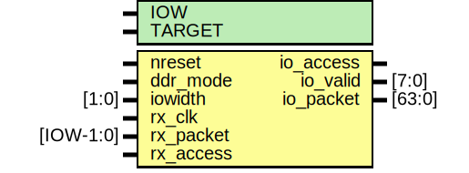

# Entity: mrx_io

- **File**: mrx_io.v
## Diagram

## Description

#############################################################################
# Purpose: MIO Receiver IO                                                  #
#############################################################################
# Author:   Andreas Olofsson                                                #
# License:  MIT (see LICENSE file in OH! repository)                        # 
#############################################################################

## Generics

| Generic name | Type | Value     | Description       |
| ------------ | ---- | --------- | ----------------- |
| IOW          |      | 64        |  IO width         |
| TARGET       |      | "GENERIC" |  target selector  |
## Ports

| Port name | Direction | Type      | Description                         |
| --------- | --------- | --------- | ----------------------------------- |
| nreset    | input     |           | async active low reset              |
| ddr_mode  | input     |           | select between sdr/ddr data         |
| iowidth   | input     | [1:0]     | dynamically configured io bus width |
| rx_clk    | input     |           | clock for IO                        |
| rx_packet | input     | [IOW-1:0] | data for IO                         |
| rx_access | input     |           | access signal for IO                |
| io_access | output    |           | fifo write                          |
| io_valid  | output    | [7:0]     | fifo byte valid                     |
| io_packet | output    | [63:0]    | fifo packet                         |
## Signals

| Name            | Type             | Description   |
| --------------- | ---------------- | ------------- |
| ddr_data        | wire [IOW-1:0]   |  local wires  |
| io_nreset       | wire             |               |
| io_data         | wire [63:0]      |               |
| mux_data        | wire [63:0]      |               |
| data_select     | wire [7:0]       |               |
| valid_input     | wire [7:0]       |               |
| valid_next      | wire [7:0]       |               |
| ddr_even        | wire [IOW/2-1:0] |               |
| ddr_odd         | wire [IOW/2-1:0] |               |
| io_frame        | wire             |               |
| dmode8          | wire             |               |
| dmode16         | wire             |               |
| dmode32         | wire             |               |
| dmode64         | wire             |               |
| reload          | wire             |               |
| transfer_done   | wire             |               |
| transfer_active | wire             |               |
| shiftreg        | reg [63:0]       |               |
| sdr_data        | reg [IOW-1:0]    |               |
| rx_access_reg   | reg [1:0]        |               |
| i               | integer          |               |
## Processes
- unnamed: ( @ (posedge rx_clk or negedge io_nreset) )
  - **Type:** always
 **Description**
Keep track of valid bytes in shift register 
- unnamed: ( @ (posedge rx_clk) )
  - **Type:** always
 **Description**
 SDR 
- unnamed: ( @ (posedge rx_clk or negedge io_nreset) )
  - **Type:** always
 **Description**
 pipeline access signal 
- unnamed: ( @ (posedge rx_clk) )
  - **Type:** always
## Instantiations

- oh_rsync: oh_rsync
 **Description**
########################################
# SYNCHRONIZERS
########################################

