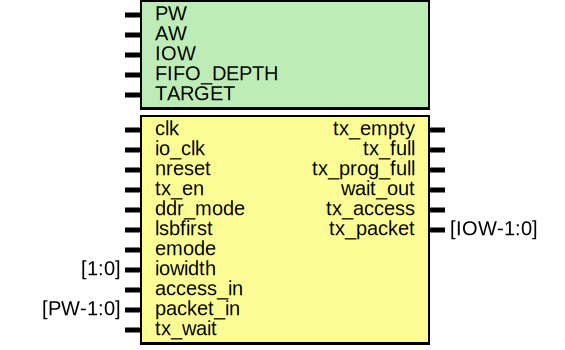

# Entity: mtx

- **File**: mtx.v
## Diagram

## Description

#############################################################################
# Purpose: MIO Transmit Datapath                                            #
#############################################################################
# Author:   Andreas Olofsson                                                #
# License:  MIT (see LICENSE file in OH! repository)                        # 
#############################################################################

## Generics

| Generic name | Type | Value     | Description       |
| ------------ | ---- | --------- | ----------------- |
| PW           |      | 104       |  fifo width       |
| AW           |      | 32        |  fifo width       |
| IOW          |      | 8         |  I./O data width  |
| FIFO_DEPTH   |      | 16        |  fifo depth       |
| TARGET       |      | "GENERIC" |  fifo target      |
## Ports

| Port name    | Direction | Type      | Description                            |
| ------------ | --------- | --------- | -------------------------------------- |
| clk          | input     |           | main core clock                        |
| io_clk       | input     |           | clock for tx logic                     |
| nreset       | input     |           | async active low reset                 |
| tx_en        | input     |           | transmit enable                        |
| ddr_mode     | input     |           | configure mio in ddr mode              |
| lsbfirst     | input     |           | send bits lsb first                    |
| emode        | input     |           | emesh mode                             |
| iowidth      | input     | [1:0]     | input width                            |
| tx_empty     | output    |           | tx fifo is empty                       |
| tx_full      | output    |           | tx fifo is full (should never happen!) |
| tx_prog_full | output    |           | tx is getting full (stop sending!)     |
| access_in    | input     |           | fifo data valid                        |
| packet_in    | input     | [PW-1:0]  | fifo packet                            |
| wait_out     | output    |           | wait pushback for fifo                 |
| tx_access    | output    |           | access signal for IO                   |
| tx_packet    | output    | [IOW-1:0] | packet for IO                          |
| tx_wait      | input     |           | pushback from IO                       |
## Signals

| Name      | Type        | Description                  |
| --------- | ----------- | ---------------------------- |
| io_packet | wire [63:0] | From mtx_fifo of mtx_fifo.v  |
| io_valid  | wire [7:0]  | From mtx_fifo of mtx_fifo.v  |
| io_wait   | wire        | From mtx_io of mtx_io.v      |
