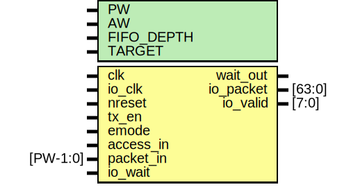

# Entity: mtx_fifo

- **File**: mtx_fifo.v
## Diagram

## Description

#############################################################################
# Purpose: MIO Transmit FIFO                                                #
#############################################################################
# Author:   Andreas Olofsson                                                #
# License:  MIT (see LICENSE file in OH! repository)                        # 
#############################################################################

## Generics

| Generic name | Type | Value     | Description     |
| ------------ | ---- | --------- | --------------- |
| PW           |      | 136       |  packet width   |
| AW           |      | 64        |  address width  |
| FIFO_DEPTH   |      | 16        |  fifo depth     |
| TARGET       |      | "GENERIC" |  fifo target    |
## Ports

| Port name | Direction | Type     | Description            |
| --------- | --------- | -------- | ---------------------- |
| clk       | input     |          | main core clock        |
| io_clk    | input     |          | clock for tx logic     |
| nreset    | input     |          | async active low reset |
| tx_en     | input     |          | transmit enable        |
| emode     | input     |          | emesh transaction mode |
| access_in | input     |          | fifo data valid        |
| packet_in | input     | [PW-1:0] | fifo packet            |
| wait_out  | output    |          | wait pushback for fifo |
| io_packet | output    | [63:0]   | packet for IO          |
| io_valid  | output    | [7:0]    | byte valids for IO     |
| io_wait   | input     |          | pushback from IO       |
## Signals

| Name            | Type          | Description                 |
| --------------- | ------------- | --------------------------- |
| emesh_cycle     | reg [1:0]     | local wires                 |
| packet_buffer   | reg [191:0]   |                             |
| fifo_access_out | wire          |                             |
| fifo_packet_out | wire [71:0]   |                             |
| fifo_access_in  | wire          |                             |
| fifo_packet_in  | wire [71:0]   |                             |
| data_wide       | wire [63:0]   |                             |
| valid           | wire [7:0]    |                             |
| emesh_wait      | wire          |                             |
| fifo_data_in    | wire [63:0]   |                             |
| fifo_wait       | wire          |                             |
| ctrlmode_in     | wire [4:0]    | From p2e of packet2emesh.v  |
| data_in         | wire [AW-1:0] | From p2e of packet2emesh.v  |
| datamode_in     | wire [1:0]    | From p2e of packet2emesh.v  |
| dstaddr_in      | wire [AW-1:0] | From p2e of packet2emesh.v  |
| srcaddr_in      | wire [AW-1:0] | From p2e of packet2emesh.v  |
| write_in        | wire          | From p2e of packet2emesh.v  |
## Processes
- unnamed: ( @ (posedge clk) )
  - **Type:** always
 **Description**
 create a dummy wide packet to avoid warnings 
- unnamed: ( @ (posedge clk or negedge nreset) )
  - **Type:** always
 **Description**
 Emesh write pipeline (note! fifo_wait means half full!) 
## Instantiations

- fifo: oh_fifo_cdc
 **Description**
########################################################
# FIFO 
#######################################################   

