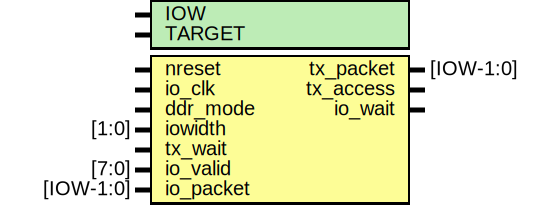

# Entity: mtx_io

- **File**: mtx_io.v
## Diagram

## Description

#############################################################################
# Purpose: MIO Transmit IO                                                  #
#############################################################################
# Author:   Andreas Olofsson                                                #
# License:  MIT (see LICENSE file in OH! repository)                        # 
#############################################################################

## Generics

| Generic name | Type | Value     | Description       |
| ------------ | ---- | --------- | ----------------- |
| IOW          |      | 64        |  IO width         |
| TARGET       |      | "GENERIC" |  target selector  |
## Ports

| Port name | Direction | Type      | Description                        |
| --------- | --------- | --------- | ---------------------------------- |
| nreset    | input     |           | async active low reset             |
| io_clk    | input     |           | clock from divider                 |
| ddr_mode  | input     |           | send data as ddr                   |
| iowidth   | input     | [1:0]     | iowidth *8,16,32,64                |
| tx_packet | output    | [IOW-1:0] | data for IO                        |
| tx_access | output    |           | access signal for IO               |
| tx_wait   | input     |           | IO wait signals                    |
| io_valid  | input     | [7:0]     | per byte valid indicator           |
| io_packet | input     | [IOW-1:0] | packet                             |
| io_wait   | output    |           | pushback to serializer in sdr mode |
## Signals

| Name            | Type             | Description  |
| --------------- | ---------------- | ------------ |
| shiftreg        | reg [63:0]       | local wires  |
| tx_state        | reg [2:0]        |              |
| tx_packet_sdr   | reg [IOW-1:0]    |              |
| io_valid_reg    | reg [7:0]        |              |
| tx_packet_ddr   | wire [IOW/2-1:0] |              |
| tx_wait_sync    | wire             |              |
| transfer_active | wire             |              |
| io_valid_next   | wire [7:0]       |              |
| ddr_data_even   | wire [IOW/2-1:0] |              |
| ddr_data_odd    | wire [IOW/2-1:0] |              |
| dmode8          | wire             |              |
| dmode16         | wire             |              |
| dmode32         | wire             |              |
| dmode64         | wire             |              |
| io_nreset       | wire             |              |
| reload          | wire             |              |
## Processes
- unnamed: ( @ (posedge io_clk or negedge io_nreset) )
  - **Type:** always
- unnamed: ( @ (posedge io_clk or negedge io_nreset) )
  - **Type:** always
 **Description**
pipeline access signal 
- unnamed: ( @ (posedge io_clk) )
  - **Type:** always
 **Description**
######################################## # SHIFT REGISTER  (SHIFT DOWN) ######################################## 
- unnamed: ( @ (posedge io_clk) )
  - **Type:** always
 **Description**
######################################## # DDR OUTPUT ########################################  pipeline sdr to compensate for ddr 
## Instantiations

- sync_reset: oh_rsync
 **Description**
########################################
# Synchronizers
########################################  
 synchronize reset to io clock

- sync_wait: oh_dsync
 **Description**
synchronize wait

