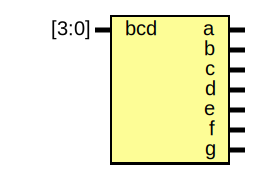

# Entity: oh_7seg_decode

- **File**: oh_7seg_decode.v
## Diagram

## Description

#############################################################################
# Function: BCD Seven Segment Decoder                                       #
#############################################################################
# Author:   Andreas Olofsson                                                #
# License:  MIT (see LICENSE file in OH! repository)                        #
#############################################################################

## Ports

| Port name | Direction | Type  | Description       |
| --------- | --------- | ----- | ----------------- |
| bcd       | input     | [3:0] | 0-9               |
| a         | output    |       | a segment (1=0ff) |
| b         | output    |       | b segment         |
| c         | output    |       | c segment         |
| d         | output    |       | d segment         |
| e         | output    |       | e segment         |
| f         | output    |       | f segment         |
| g         | output    |       | g segment         |
