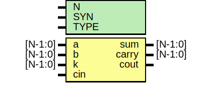

# Entity: oh_add

- **File**: oh_add.v
## Diagram

## Description

#############################################################################
# Function: Binary adder                                                    #
#############################################################################
# Author:   Andreas Olofsson                                                #
# License:  MIT (see LICENSE file in OH! repository)                        #
#############################################################################

## Generics

| Generic name | Type | Value     | Description           |
| ------------ | ---- | --------- | --------------------- |
| N            |      | 32        |  block width          |
| SYN          |      | "TRUE"    |  synthesizable        |
| TYPE         |      | "DEFAULT" |  implementation type  |
## Ports

| Port name | Direction | Type    | Description                      |
| --------- | --------- | ------- | -------------------------------- |
| a         | input     | [N-1:0] | first operand                    |
| b         | input     | [N-1:0] | second operand                   |
| k         | input     | [N-1:0] | carrry kill signal (active high) |
| cin       | input     |         | carry in                         |
| sum       | output    | [N-1:0] | sum                              |
| carry     | output    | [N-1:0] | complete carry out vector        |
| cout      | output    |         | carry out from msb               |
