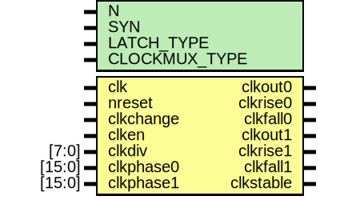

# Entity: oh_clockdiv

- **File**: oh_clockdiv.v
## Diagram

## Description

#############################################################################
# Purpose: Clock divider with 2 outputs                                     #
           Secondary clock must be multiple of first clock                  #
#############################################################################
# Author:   Andreas Olofsson                                                #
# License:  MIT (see LICENSE file in OH! repository)                        #
#############################################################################

## Generics

| Generic name  | Type | Value     | Description              |
| ------------- | ---- | --------- | ------------------------ |
| N             |      | 2         |  data width              |
| SYN           |      | "TRUE"    |  synthesizable (or not)  |
| LATCH_TYPE    |      | "DEFAULT" |  implementation type     |
| CLOCKMUX_TYPE |      | "DEFAULT" |  implementation type     |
## Ports

| Port name | Direction | Type   | Description                                     |
| --------- | --------- | ------ | ----------------------------------------------- |
| clk       | input     |        | main clock                                      |
| nreset    | input     |        | async active low reset (from oh_rsync)          |
| clkchange | input     |        | indicates a parameter change                    |
| clken     | input     |        | clock enable                                    |
| clkdiv    | input     | [7:0]  | [7:0]=period (0==bypass, 1=div/2, 2=div/3, etc) |
| clkphase0 | input     | [15:0] | [7:0]=rising,[15:8]=falling                     |
| clkphase1 | input     | [15:0] | [7:0]=rising,[15:8]=falling                     |
| clkout0   | output    |        | primary output clock                            |
| clkrise0  | output    |        | rising edge match                               |
| clkfall0  | output    |        | falling edge match                              |
| clkout1   | output    |        | secondary output clock                          |
| clkrise1  | output    |        | rising edge match                               |
| clkfall1  | output    |        | falling edge match                              |
| clkstable | output    |        | clock is guaranteed to be stable                |
## Signals

| Name          | Type       | Description |
| ------------- | ---------- | ----------- |
| counter       | reg [7:0]  | regs        |
| clkout0_reg   | reg        |             |
| clkout1_reg   | reg        |             |
| clkout1_shift | reg        |             |
| period        | reg [2:0]  |             |
| period_match  | wire       |             |
| clk1_sel      | wire [3:0] |             |
| clk1_sel_sh   | wire [3:0] |             |
| clk0_sel      | wire [1:0] |             |
| clk0_sel_sh   | wire [1:0] |             |
## Processes
- unnamed: ( @ (posedge clk or negedge nreset) )
  - **Type:** always
 **Description**
########################################### # CHANGE DETECT (count 8 periods) ########################################### 
- unnamed: ( @ (posedge clk or negedge nreset) )
  - **Type:** always
 **Description**
########################################### # CYCLE COUNTER ########################################### 
- unnamed: ( @ (posedge clk or negedge nreset) )
  - **Type:** always
 **Description**
########################################### # CLKOUT0 ########################################### 
- unnamed: ( @ (posedge clk or negedge nreset) )
  - **Type:** always
 **Description**
########################################### # CLKOUT1 ########################################### 
- unnamed: ( @ (negedge clk) )
  - **Type:** always
 **Description**
 creating divide by 2 shifted clock with negedge 
## Instantiations

- oh_lat0: oh_lat0
 **Description**
 clock select needs to be stable high

- oh_clockmux2: oh_clockmux2
- latch_clk1: oh_lat0
 **Description**
 all others
 clock select needs to be stable high

- mux_clk1: oh_clockmux4
 **Description**
 all others

