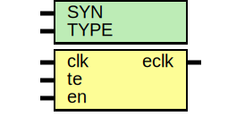

# Entity: oh_clockgate

- **File**: oh_clockgate.v
## Diagram

## Description

#############################################################################
# Function: Low power clock gate circuit                                    #
#############################################################################
# Author:   Andreas Olofsson                                                #
# License:  MIT (see LICENSE file in OH! repository)                        #
#############################################################################

## Generics

| Generic name | Type | Value     | Description           |
| ------------ | ---- | --------- | --------------------- |
| SYN          |      | "TRUE"    |  synthesizable        |
| TYPE         |      | "DEFAULT" |  implementation type  |
## Ports

| Port name | Direction | Type | Description                    |
| --------- | --------- | ---- | ------------------------------ |
| clk       | input     |      | clock input                    |
| te        | input     |      | test enable                    |
| en        | input     |      | enable (from positive edge FF) |
| eclk      | output    |      | enabled clock output           |
