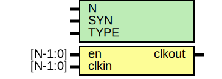

# Entity: oh_clockmux

- **File**: oh_clockmux.v
## Diagram

## Description

#############################################################################
# Function: Parametrized clock mux (N to 1)                                 #
#############################################################################
# Author:   Andreas Olofsson                                                #
# License:  MIT (see LICENSE file in OH! repository)                        #
#############################################################################

## Generics

| Generic name | Type | Value     | Description               |
| ------------ | ---- | --------- | ------------------------- |
| N            |      | 2         |  number of clock inputs)  |
| SYN          |      | "TRUE"    |  synthesizable (or not)   |
| TYPE         |      | "DEFAULT" |  implementation type      |
## Ports

| Port name | Direction | Type    | Description                                 |
| --------- | --------- | ------- | ------------------------------------------- |
| en        | input     | [N-1:0] | one hot enable vector (needs to be stable!) |
| clkin     | input     | [N-1:0] | one hot clock inputs (only one is active!)  |
| clkout    | output    |         | clock output                                |
