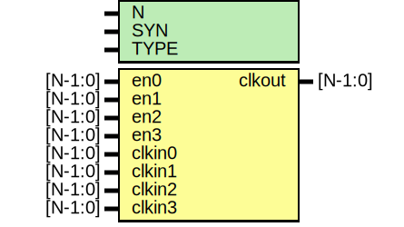

# Entity: oh_clockmux4

- **File**: oh_clockmux4.v
## Diagram

## Description

#############################################################################
# Function: 4:1 Clock Mux                                                   #
#############################################################################
# Author:   Andreas Olofsson                                                #
# License:  MIT (see LICENSE file in OH! repository)                        #
#############################################################################

## Generics

| Generic name | Type | Value     | Description              |
| ------------ | ---- | --------- | ------------------------ |
| N            |      | 1         |  vector width            |
| SYN          |      | "TRUE"    |  synthesizable (or not)  |
| TYPE         |      | "DEFAULT" |  implementation type     |
## Ports

| Port name | Direction | Type    | Description                 |
| --------- | --------- | ------- | --------------------------- |
| en0       | input     | [N-1:0] | clkin0 enable (stable high) |
| en1       | input     | [N-1:0] | clkin1 enable (stable high) |
| en2       | input     | [N-1:0] | clkin1 enable (stable high) |
| en3       | input     | [N-1:0] | clkin1 enable (stable high) |
| clkin0    | input     | [N-1:0] | clock input                 |
| clkin1    | input     | [N-1:0] | clock input                 |
| clkin2    | input     | [N-1:0] | clock input                 |
| clkin3    | input     | [N-1:0] | clock input                 |
| clkout    | output    | [N-1:0] | clock output                |
