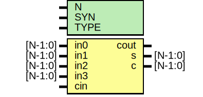

# Entity: oh_csa42

- **File**: oh_csa42.v
## Diagram

## Description

#############################################################################
# Function: Carry Save Adder (4:2)                                          #
#############################################################################
# Author:   Andreas Olofsson                                                #
# License:  MIT (see LICENSE file in OH! repository)                        #
#############################################################################

## Generics

| Generic name | Type | Value     | Description              |
| ------------ | ---- | --------- | ------------------------ |
| N            |      | 1         |  number of sync stages   |
| SYN          |      | "TRUE"    |  synthesizable (or not)  |
| TYPE         |      | "DEFAULT" |  scell type/size         |
## Ports

| Port name | Direction | Type    | Description                    |
| --------- | --------- | ------- | ------------------------------ |
| in0       | input     | [N-1:0] | input                          |
| in1       | input     | [N-1:0] | input                          |
| in2       | input     | [N-1:0] | input                          |
| in3       | input     | [N-1:0] | input                          |
| cin       | input     |         | intra stage carry in           |
| cout      | output    |         | intra stage carry out (2x sum) |
| s         | output    | [N-1:0] | sum                            |
| c         | output    | [N-1:0] | carry (=2x sum)                |
