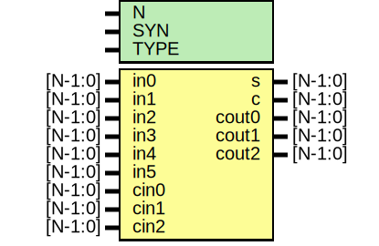

# Entity: oh_csa62

- **File**: oh_csa62.v
## Diagram

## Description

#############################################################################
# Function: Carry Save Adder (6:2)                                          #
#############################################################################
# Author:   Andreas Olofsson                                                #
# License:  MIT (see LICENSE file in OH! repository)                        #
#############################################################################

## Generics

| Generic name | Type | Value     | Description              |
| ------------ | ---- | --------- | ------------------------ |
| N            |      | 1         |  number of sync stages   |
| SYN          |      | "TRUE"    |  synthesizable (or not)  |
| TYPE         |      | "DEFAULT" |  scell type/size         |
## Ports

| Port name | Direction | Type    | Description |
| --------- | --------- | ------- | ----------- |
| in0       | input     | [N-1:0] | input       |
| in1       | input     | [N-1:0] | input       |
| in2       | input     | [N-1:0] | input       |
| in3       | input     | [N-1:0] | input       |
| in4       | input     | [N-1:0] | input       |
| in5       | input     | [N-1:0] | input       |
| cin0      | input     | [N-1:0] | carry in    |
| cin1      | input     | [N-1:0] | carry in    |
| cin2      | input     | [N-1:0] | carry in    |
| s         | output    | [N-1:0] | sum         |
| c         | output    | [N-1:0] | carry       |
| cout0     | output    | [N-1:0] | carry out   |
| cout1     | output    | [N-1:0] | carry out   |
| cout2     | output    | [N-1:0] | carry out   |
## Signals

| Name   | Type         | Description |
| ------ | ------------ | ----------- |
| s_int0 | wire [N-1:0] |             |
| s_int1 | wire [N-1:0] |             |
