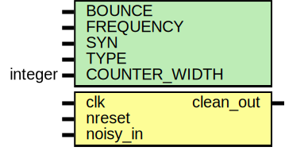

# Entity: oh_debouncer

- **File**: oh_debouncer.v
## Diagram

## Description

#############################################################################
# Function: A digital debouncer circuit                                     #
#############################################################################
# Author:   Andreas Olofsson                                                #
# License:  MIT (see LICENSE file in OH! repository)                        #
#############################################################################

## Generics

| Generic name  | Type    | Value                    | Description              |
| ------------- | ------- | ------------------------ | ------------------------ |
| BOUNCE        |         | 100                      |  bounce time (s)         |
| FREQUENCY     |         | 1000000                  |  clock frequency (1Mhz)  |
| SYN           |         | "TRUE"                   |  synthesizable (or not)  |
| TYPE          |         | "DEFAULT"                |  scell type/size         |
| COUNTER_WIDTH | integer | $clog2(BOUNCE*FREQUENCY) |                          |
## Ports

| Port name | Direction | Type | Description                  |
| --------- | --------- | ---- | ---------------------------- |
| clk       | input     |      | clock to synchronize to      |
| nreset    | input     |      | syncronous active high reset |
| noisy_in  | input     |      | noisy input signal to filter |
| clean_out | output    |      | clean signal to logic        |
## Signals

| Name      | Type | Description |
| --------- | ---- | ----------- |
| noisy_reg | reg  | regs        |
| clean_reg | reg  |             |
## Processes
- unnamed: ( @ (posedge clk or negedge nreset) )
  - **Type:** always
 **Description**
 detecting change in state on input 
- unnamed: ( @ (posedge clk or negedge nreset) )
  - **Type:** always
 **Description**
 sample noisy signal safely 
## Instantiations

- dsync: oh_dsync
 **Description**
 synchronize incoming signal

- rsync: oh_rsync
 **Description**
 synchronize reset to clk

- oh_counter: oh_counter
 **Description**
 synchronous counter "filter"

