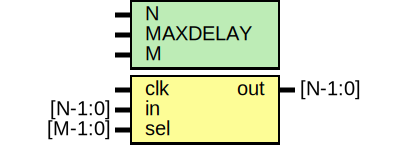

# Entity: oh_delay

- **File**: oh_delay.v
## Diagram

## Description

#############################################################################
# Function: Delays input signal by N clock cycles                           #
#############################################################################
# Author:   Andreas Olofsson                                                #
# License:  MIT (see LICENSE file in OH! repository)                        #
#############################################################################

## Generics

| Generic name | Type | Value            | Description            |
| ------------ | ---- | ---------------- | ---------------------- |
| N            |      | 1                |  width of data         |
| MAXDELAY     |      | 4                |  maximum delay cycles  |
| M            |      | $clog2(MAXDELAY) |  delay selctor         |
## Ports

| Port name | Direction | Type    | Description    |
| --------- | --------- | ------- | -------------- |
| clk       | input     |         | clock input    |
| in        | input     | [N-1:0] | input vector   |
| sel       | input     | [M-1:0] | delay selector |
| out       | output    | [N-1:0] | output vector  |
## Signals

| Name      | Type        | Description     |
| --------- | ----------- | --------------- |
| sync_pipe | reg [N-1:0] | Delay pipeline  |
