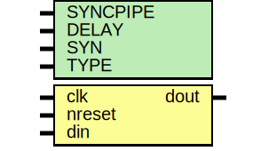

# Entity: oh_dsync

- **File**: oh_dsync.v
## Diagram

## Description

#############################################################################
# Function: Clock synchronizer                                              #
#############################################################################
# Author:   Andreas Olofsson                                                #
# License:  MIT (see LICENSE file in OH! repository)                        #
#############################################################################

## Generics

| Generic name | Type | Value     | Description             |
| ------------ | ---- | --------- | ----------------------- |
| SYNCPIPE     |      | 2         |  number of sync stages  |
| DELAY        |      | 0         |  random delay           |
| SYN          |      | "TRUE"    |  true=synthesizable     |
| TYPE         |      | "DEFAULT" |  scell type/size        |
## Ports

| Port name | Direction | Type | Description       |
| --------- | --------- | ---- | ----------------- |
| clk       | input     |      | clock             |
| nreset    | input     |      | clock             |
| din       | input     |      | input data        |
| dout      | output    |      | synchronized data |
