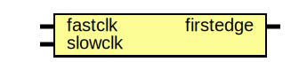

# Entity: oh_edgealign

- **File**: oh_edgealign.v
## Diagram

## Description

#############################################################################
# Function: Aligns positive edge of slow clock to fast clock                #
#           !!!Assumes clocks are aligned and synchronous!!!                #
#############################################################################
# Author:   Andreas Olofsson                                                #
# License:  MIT (see LICENSE file in OH! repository)                        # 
#############################################################################

## Ports

| Port name | Direction | Type | Description |
| --------- | --------- | ---- | ----------- |
| fastclk   | input     |      |             |
| slowclk   | input     |      |             |
| firstedge | output    |      |             |
## Signals

| Name      | Type | Description |
| --------- | ---- | ----------- |
| clk45     | reg  |             |
| clk90     | reg  |             |
| firstedge | reg  |             |
## Processes
- unnamed: ( @ (negedge fastclk) )
  - **Type:** always
- unnamed: ( @ (posedge fastclk) )
  - **Type:** always
