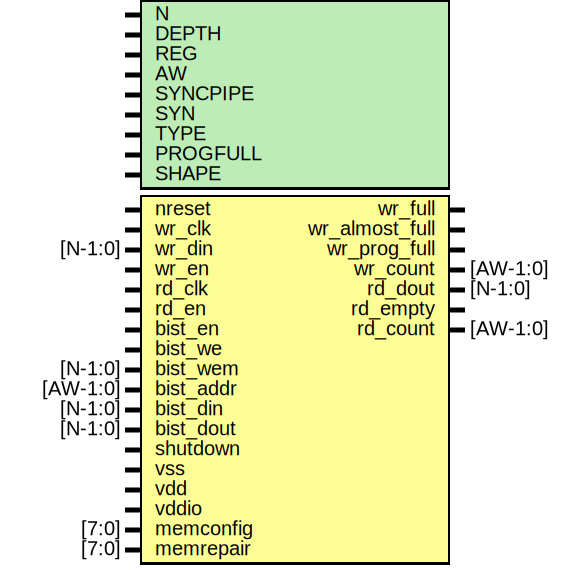

# Entity: oh_fifo_async

- **File**: oh_fifo_async.v
## Diagram

## Description

#############################################################################
# Function: Parametrized FIFO                                               #
#############################################################################
 Notes:                                                                     #
 Soft reference implementation always instantiated                          #
 Assumed to be optimized away in synthesis if needed                        #
# Author:   Andreas Olofsson                                                #
# License:  MIT (see LICENSE file in OH! repository)                        #
#############################################################################

## Generics

| Generic name | Type | Value         | Description                             |
| ------------ | ---- | ------------- | --------------------------------------- |
| N            |      | 32            |  FIFO width                             |
| DEPTH        |      | 32            |  FIFO depth                             |
| REG          |      | 1             |  Register fifo output                   |
| AW           |      | $clog2(DEPTH) |  rd_count width (derived)               |
| SYNCPIPE     |      | 2             |  depth of synchronization pipeline      |
| SYN          |      | "TRUE"        |  synthesizable                          |
| TYPE         |      | "DEFAULT"     |  implementation type                    |
| PROGFULL     |      | DEPTH-1       |  programmable almost full level         |
| SHAPE        |      | "SQUARE"      |  hard macro shape (square, tall, wide)  |
## Ports

| Port name      | Direction | Type     | Description                                |
| -------------- | --------- | -------- | ------------------------------------------ |
| nreset         | input     |          | nreset                                     |
| wr_clk         | input     |          | write port                                 |
| wr_din         | input     | [N-1:0]  | data to write                              |
| wr_en          | input     |          | write fifo                                 |
| wr_full        | output    |          | fifo full                                  |
| wr_almost_full | output    |          | one entry left                             |
| wr_prog_full   | output    |          | programmable full level                    |
| wr_count       | output    | [AW-1:0] | pessimistic report of entries from wr side |
| rd_clk         | input     |          | read port                                  |
| rd_dout        | output    | [N-1:0]  | output data (next cycle)                   |
| rd_en          | input     |          | read fifo                                  |
| rd_empty       | output    |          | fifo is empty                              |
| rd_count       | output    | [AW-1:0] | pessimistic report of entries from rd side |
| bist_en        | input     |          | bist enable                                |
| bist_we        | input     |          | write enable global signal                 |
| bist_wem       | input     | [N-1:0]  | write enable vector                        |
| bist_addr      | input     | [AW-1:0] | address                                    |
| bist_din       | input     | [N-1:0]  | data input                                 |
| bist_dout      | input     | [N-1:0]  | data input                                 |
| shutdown       | input     |          | shutdown signal                            |
| vss            | input     |          | ground signal                              |
| vdd            | input     |          | memory array power                         |
| vddio          | input     |          | periphery/io power                         |
| memconfig      | input     | [7:0]    | generic memory config                      |
| memrepair      | input     | [7:0]    | repair vector                              |
## Signals

| Name              | Type        | Description                          |
| ----------------- | ----------- | ------------------------------------ |
| wr_addr           | reg [AW:0]  | extra bit for wraparound comparison  |
| rd_addr           | reg [AW:0]  |                                      |
| wr_addr_gray      | wire [AW:0] |                                      |
| wr_addr_gray_sync | wire [AW:0] |                                      |
| rd_addr_gray      | wire [AW:0] |                                      |
| rd_addr_gray_sync | wire [AW:0] |                                      |
| rd_addr_sync      | wire [AW:0] |                                      |
| fifo_write        | wire        |                                      |
| rd_nreset         | wire        |                                      |
| wr_nreset         | wire        |                                      |
## Processes
- unnamed: ( @ ( posedge wr_clk or negedge wr_nreset) )
  - **Type:** always
- unnamed: ( @ ( posedge rd_clk or negedge rd_nreset) )
  - **Type:** always
 **Description**
########################### # Read side address counter ########################### 
## Instantiations

- wr_rsync: oh_rsync
 **Description**
###########################
# Reset synchronizers
###########################

- rd_rsync: oh_rsync
- wr_bin2gray: oh_bin2gray
 **Description**
############################################
# Synchronizaztion logic for async FIFO
############################################
###########################
# WRITE --> READ
###########################
 convert to gray code (only one bit can toggle)

- wr_sync[AW:0]: oh_dsync
 **Description**
 synchronize to read clock

- rd_bin2gray: oh_bin2gray
 **Description**
###########################
# READ ---> WRITE
###########################

- rd_sync[AW:0]: oh_dsync
 **Description**
synchronize to wr clock

