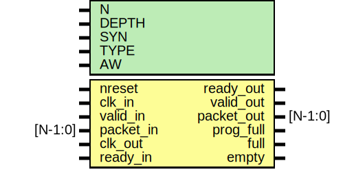

# Entity: oh_fifo_cdc

- **File**: oh_fifo_cdc.v
## Diagram

## Description

#############################################################################
# Function: Clock domain crossing FIFO                                      #
#############################################################################
# Author:   Andreas Olofsson                                                #
# License:  MIT (see LICENSE file in OH! repository)                        #
#############################################################################

## Generics

| Generic name | Type | Value         | Description                |
| ------------ | ---- | ------------- | -------------------------- |
| N            |      | 32            |  FIFO width                |
| DEPTH        |      | 32            |  FIFO depth                |
| SYN          |      | "TRUE"        |  true=synthesizable        |
| TYPE         |      | "DEFAULT"     |  true=synthesizable        |
| AW           |      | $clog2(DEPTH) |  rd_count width (derived)  |
## Ports

| Port name  | Direction | Type    | Description            |
| ---------- | --------- | ------- | ---------------------- |
| nreset     | input     |         | async active low reset |
| clk_in     | input     |         | write clock            |
| valid_in   | input     |         | write valid            |
| packet_in  | input     | [N-1:0] | write packet           |
| ready_out  | output    |         | write pushback         |
| clk_out    | input     |         | read clock             |
| valid_out  | output    |         | read valid             |
| packet_out | output    | [N-1:0] | read packet            |
| ready_in   | input     |         | read pushback          |
| prog_full  | output    |         | fifo is half full      |
| full       | output    |         | fifo is full           |
| empty      | output    |         | fifo is empty          |
## Processes
- unnamed: ( @ (posedge clk_out or negedge nreset_out) )
  - **Type:** always
 **Description**
align valid signal with FIFO read delay 
## Instantiations

- sync_reset: oh_rsync
 **Description**
async asser, sync deassert of reset

