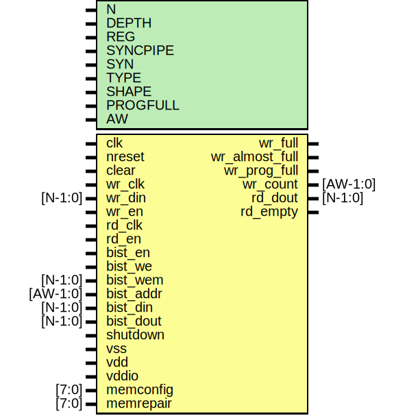

# Entity: oh_fifo_sync

- **File**: oh_fifo_sync.v
## Diagram

## Description

#############################################################################
# Function: Synchronous FIFO                                                #
#############################################################################
# Author:   Andreas Olofsson                                                #
# License:  MIT (see LICENSE file in OH! repository)                        #
#############################################################################

## Generics

| Generic name | Type | Value         | Description                              |
| ------------ | ---- | ------------- | ---------------------------------------- |
| N            |      | 32            |  FIFO width                              |
| DEPTH        |      | 32            |  FIFO depth                              |
| REG          |      | 1             |  Register fifo output                    |
| SYNCPIPE     |      | 2             |  depth of synchronization pipeline       |
| SYN          |      | "TRUE"        |  synthesizable                           |
| TYPE         |      | "DEFAULT"     |  implementation type                     |
| SHAPE        |      | "SQUARE"      |  hard macro shape (square, tall, wide),  |
| PROGFULL     |      | DEPTH-1       |  programmable almost full level          |
| AW           |      | $clog2(DEPTH) |  count width (derived)                   |
## Ports

| Port name      | Direction | Type     | Description                                |
| -------------- | --------- | -------- | ------------------------------------------ |
| clk            | input     |          | clock                                      |
| nreset         | input     |          | async reset                                |
| clear          | input     |          | clear fifo (synchronous)                   |
| wr_clk         | input     |          | write port                                 |
| wr_din         | input     | [N-1:0]  | data to write                              |
| wr_en          | input     |          | write fifo                                 |
| wr_full        | output    |          | fifo full                                  |
| wr_almost_full | output    |          | one entry left                             |
| wr_prog_full   | output    |          | programmable full level                    |
| wr_count       | output    | [AW-1:0] | pessimistic report of entries from wr side |
| rd_clk         | input     |          | read port                                  |
| rd_dout        | output    | [N-1:0]  | output data (next cycle)                   |
| rd_en          | input     |          | read fifo                                  |
| rd_empty       | output    |          | fifo is empty                              |
| bist_en        | input     |          | bist enable                                |
| bist_we        | input     |          | write enable global signal                 |
| bist_wem       | input     | [N-1:0]  | write enable vector                        |
| bist_addr      | input     | [AW-1:0] | address                                    |
| bist_din       | input     | [N-1:0]  | data input                                 |
| bist_dout      | input     | [N-1:0]  | data input                                 |
| shutdown       | input     |          | shutdown signal                            |
| vss            | input     |          | ground signal                              |
| vdd            | input     |          | memory array power                         |
| vddio          | input     |          | periphery/io power                         |
| memconfig      | input     | [7:0]    | generic memory config                      |
| memrepair      | input     | [7:0]    | repair vector                              |
## Signals

| Name       | Type       | Description                                                            |
| ---------- | ---------- | ---------------------------------------------------------------------- |
| wr_addr    | reg [AW:0] | ############################ local wires ############################  |
| rd_addr    | reg [AW:0] |                                                                        |
| empty_reg  | reg        |                                                                        |
| fifo_read  | wire       |                                                                        |
| fifo_write | wire       |                                                                        |
| ptr_match  | wire       |                                                                        |
| fifo_empty | wire       |                                                                        |
## Processes
- unnamed: ( @ (posedge clk or negedge nreset) )
  - **Type:** always
- unnamed: ( @ (posedge clk) )
  - **Type:** always
 **Description**
Pipeline register to account for RAM output register 
