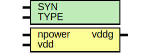

# Entity: oh_header

- **File**: oh_header.v
## Diagram

## Description

#############################################################################
# Function: Power supply header switch                                      #
#############################################################################
# Author:   Andreas Olofsson                                                #
# License:  MIT (see LICENSE file in OH! repository)                        #
#############################################################################

## Generics

| Generic name | Type | Value     | Description          |
| ------------ | ---- | --------- | -------------------- |
| SYN          |      | "TRUE"    |  true=synthesizable  |
| TYPE         |      | "DEFAULT" |  scell type/size     |
## Ports

| Port name | Direction | Type | Description         |
| --------- | --------- | ---- | ------------------- |
| npower    | input     |      | active low power on |
| vdd       | input     |      | input supply        |
| vddg      | output    |      | gated output supply |
