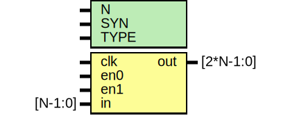

# Entity: oh_iddr

- **File**: oh_iddr.v
## Diagram

## Description

#############################################################################
# Function: Dual data rate input buffer (2 cycle delay)                     #
#############################################################################
# Author:   Andreas Olofsson                                                #
# License:  MIT (see LICENSE file in OH! repository)                        #
#############################################################################

## Generics

| Generic name | Type | Value     | Description              |
| ------------ | ---- | --------- | ------------------------ |
| N            |      | 1         |  vector width            |
| SYN          |      | "TRUE"    |  synthesizable (or not)  |
| TYPE         |      | "DEFAULT" |  scell type/size         |
## Ports

| Port name | Direction | Type      | Description                               |
| --------- | --------- | --------- | ----------------------------------------- |
| clk       | input     |           | clock                                     |
| en0       | input     |           | 1st cycle enable                          |
| en1       | input     |           | 2nd cycle enable                          |
| in        | input     | [N-1:0]   | data input sampled on both edges of clock |
| out       | output    | [2*N-1:0] | iddr aligned                              |
