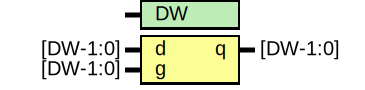

# Entity: oh_latq

- **File**: oh_latq.v
## Diagram

## Description

#############################################################################
# Function:  D-type active-high transparent latch                           #
#                                                                           #
# Copyright: OH Project Authors. ALl rights Reserved.                       #
# License:   MIT (see LICENSE file in OH repository)                        # 
#############################################################################

## Generics

| Generic name | Type | Value | Description   |
| ------------ | ---- | ----- | ------------- |
| DW           |      | 1     |  array width  |
## Ports

| Port name | Direction | Type     | Description |
| --------- | --------- | -------- | ----------- |
| d         | input     | [DW-1:0] |             |
| g         | input     | [DW-1:0] |             |
| q         | output    | [DW-1:0] |             |
## Processes
- unnamed: (  )
  - **Type:** always_latch
